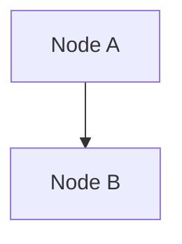
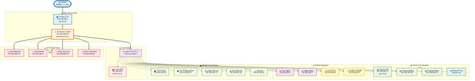

# 🤖 Automatisierung & Workflow

> **Detaillierte Dokumentation der Automatisierungsprozesse**
> Teil der WG Merzhauser Netzwerk-Infrastruktur
> [← Zurück zur Hauptdokumentation](HAUPTDOKUMENTATION.md)

---

## 📋 Inhaltsverzeichnis

1. [Proxmox Auto-Documentation](#-proxmox-auto-documentation-script)
2. [Mermaid-Diagramm Automatisierung](#-mermaid-diagramm-automatisierung)
3. [Netzwerk-Monitoring](#-netzwerk-monitoring)

---

## 🤖 Proxmox Auto-Documentation Script

Das Repository enthält ein automatisiertes Script zur Generierung der Proxmox-Dokumentation:

### Script-Features:
- **Automatische Erkennung** aller VMs und LXC Container
- **Mermaid-Diagramm-Generierung** der gesamten Infrastruktur
- **Detaillierte Tabellen** mit Hardware-Konfiguration
- **Storage- und Netzwerk-Analyse**
- **Cluster-Status-Monitoring**

### Verwendung:
```bash
# Auf Proxmox-Server ausführen
chmod +x generate-proxmox-documentation.sh
./generate-proxmox-documentation.sh

# Generiert: proxmox.md mit aktueller Infrastruktur
```

### Automatisierung per Cron:
```bash
# Tägliche Dokumentations-Updates um 2 Uhr
0 2 * * * /path/to/generate-proxmox-documentation.sh

# Ausgabe nach Git pushen (optional)
5 2 * * * cd /path/to/repo && git add . && git commit -m "Auto-update $(date)" && git push
```

---

## 📊 Mermaid-Diagramm Automatisierung

Alle Netzwerk-Diagramme in dieser Dokumentation werden als Mermaid-Code in `.mmd`-Dateien gespeichert und automatisch zu Bildern gerendert.

### 🗂️ Diagramm-Struktur

```
docs/claude/diagrams/
├── infrastructure.mmd          # Haupt-Infrastruktur-Diagramm
├── dns-flow.mmd               # DNS & Pi-hole Flow
├── firewall-architecture.mmd  # Firewall & Routing
├── switch-ports.mmd           # Switch-Konfiguration (falls vorhanden)
├── vpn-topology.mmd           # VPN-Übersicht
└── ... (weitere Diagramme)
```

### 🔧 Diagramme Generieren

**Alle Diagramme neu erstellen:**
```bash
cd docs/claude
make diagrams
```

**Nur veränderte Diagramme neu erstellen:**
```bash
# Make erkennt automatisch geänderte .mmd-Dateien
# und generiert nur diese neu (basierend auf Datei-Timestamps)
cd docs/claude
make diagrams
```

**Einzelnes Diagramm erstellen:**
```bash
cd docs/claude
make diagrams/infrastructure.png    # Nur PNG
make diagrams/infrastructure.svg    # Nur SVG

# Oder manuell mit mmdc:
mmdc -i diagrams/infrastructure.mmd -o diagrams/infrastructure.png
```

**Alle generierten Bilder löschen:**
```bash
cd docs/claude
make clean
```

### 📝 Diagramme in Markdown Einbinden

**Option 1: Live-Rendering mit Mermaid.js (Web)**
````markdown

````

**Option 2: Statische Bilder (für PDF/Print)**
```markdown

```

**Option 3: Beide Varianten kombinieren**
````markdown
<!-- Mermaid-Code für Web-Ansicht -->


<!-- Alternativ: Bild für PDF/Export -->

````

### 🔄 Workflow: Diagramme Aktualisieren

**1. Diagramm bearbeiten:**
```bash
# Bearbeite die .mmd-Datei
nano docs/claude/diagrams/infrastructure.mmd

# Oder aus HAUPTDOKUMENTATION.md extrahieren
```

**2. Bilder neu generieren:**
```bash
cd docs/claude
make diagrams
# ✔ Nur geänderte Dateien werden neu erstellt!
```

**3. Änderungen committen:**
```bash
git add docs/claude/diagrams/infrastructure.mmd
git add docs/claude/diagrams/infrastructure.png
git add docs/claude/diagrams/infrastructure.svg
git commit -m "Update infrastructure diagram"
```

### 🤖 Automatisierung beim Git Push

#### Pre-Commit Hook (Automatische Generierung vor Commit)

Erstelle `.git/hooks/pre-commit`:
```bash
#!/bin/bash
# Automatisch Diagramme generieren wenn .mmd-Dateien geändert wurden

# Prüfe ob .mmd-Dateien geändert wurden
if git diff --cached --name-only | grep -q '\.mmd$'; then
    echo "🎨 Generiere Mermaid-Diagramme..."

    cd docs/claude
    make diagrams

    # Generierte Bilder zum Commit hinzufügen
    git add diagrams/*.png diagrams/*.svg

    echo "✔ Diagramme aktualisiert und zum Commit hinzugefügt"
fi
```

**Hook installieren:**
```bash
# Hook erstellen
cat > .git/hooks/pre-commit << 'EOF'
#!/bin/bash
if git diff --cached --name-only | grep -q '\.mmd$'; then
    echo "🎨 Generiere Mermaid-Diagramme..."
    cd docs/claude
    make diagrams
    git add diagrams/*.png diagrams/*.svg
    echo "✔ Diagramme aktualisiert"
fi
EOF

# Ausführbar machen
chmod +x .git/hooks/pre-commit
```

#### GitHub Actions (Automatische Generierung bei Push)

Erstelle `.github/workflows/diagrams.yml`:
```yaml
name: Generate Mermaid Diagrams

on:
  push:
    paths:
      - 'docs/claude/diagrams/*.mmd'
  pull_request:
    paths:
      - 'docs/claude/diagrams/*.mmd'

jobs:
  generate-diagrams:
    runs-on: ubuntu-latest
    steps:
      - uses: actions/checkout@v3

      - name: Setup Node.js
        uses: actions/setup-node@v3
        with:
          node-version: '18'

      - name: Install Mermaid CLI
        run: npm install -g @mermaid-js/mermaid-cli

      - name: Generate Diagrams
        run: |
          cd docs/claude
          make diagrams

      - name: Commit generated files
        run: |
          git config --local user.email "action@github.com"
          git config --local user.name "GitHub Action"
          git add docs/claude/diagrams/*.png docs/claude/diagrams/*.svg
          git diff --quiet && git diff --staged --quiet || git commit -m "🎨 Auto-generate diagrams"
          git push
```

### 🛠️ Makefile Funktionsweise

Das `docs/claude/Makefile` nutzt Make's Dependency-System:

```makefile
# Findet alle .mmd-Dateien
MMD_FILES := $(wildcard diagrams/*.mmd)

# Definiert Ziel-Dateien (PNG & SVG)
PNG_FILES := $(MMD_FILES:.mmd=.png)
SVG_FILES := $(MMD_FILES:.mmd=.svg)

# Regel: PNG aus MMD generieren
diagrams/%.png: diagrams/%.mmd
    mmdc -i $< -o $@

# Regel: SVG aus MMD generieren
diagrams/%.svg: diagrams/%.mmd
    mmdc -i $< -o $@
```

**Vorteile:**
- ✅ **Nur geänderte Dateien** werden neu generiert
- ✅ **Timestamp-basiert**: Make vergleicht Änderungszeiten
- ✅ **Schnell**: Überspringe unveränderte Diagramme
- ✅ **Parallel**: Mehrere Diagramme gleichzeitig generieren

### 📦 Abhängigkeiten

**Erforderliche Tools:**
```bash
# Mermaid CLI (mmdc)
npm install -g @mermaid-js/mermaid-cli

# Alternative: Über Snap
snap install mermaid

# Prüfen ob installiert
which mmdc
mmdc --version
```

### 💡 Best Practices

1. **Diagramme immer in .mmd-Dateien pflegen**
   - Nicht direkt PNG/SVG bearbeiten
   - Quellcode in Git versionieren

2. **Vor jedem Commit: `make diagrams` ausführen**
   - Oder Pre-Commit Hook nutzen
   - Stellt sicher, dass Bilder aktuell sind

3. **Beide Formate committen (PNG + SVG)**
   - PNG: Für Dokumentation & Web
   - SVG: Für Vektor-Qualität & Print

4. **Große Diagramme aufteilen**
   - Bessere Lesbarkeit
   - Schnellere Generierung
   - Einfacher zu warten

---

## 📈 Netzwerk-Monitoring

### Überwachte Metriken:
- **Bandwidth-Nutzung** über FritzBox
- **DNS-Query-Statistiken** über Pi-hole
- **VM/Container-Performance** über Proxmox
- **Firewall-Logs** über OPNsense
- **Device-Connectivity** über SNMP

### Alert-System:
- 📧 **E-Mail-Benachrichtigungen** bei Ausfällen
- 📱 **Push-Notifications** für kritische Events
- 📊 **Dashboard-Updates** in Echtzeit

---

[← Zurück zur Hauptdokumentation](HAUPTDOKUMENTATION.md)
