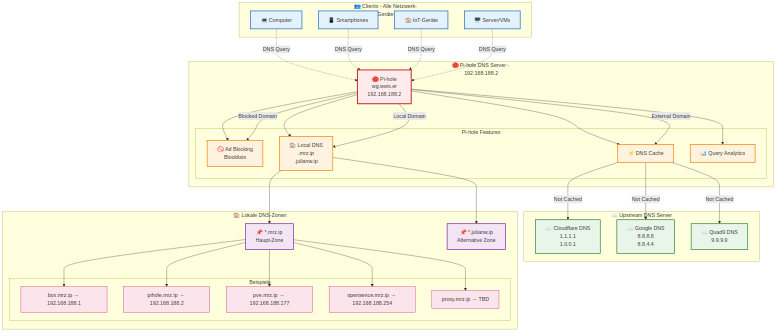

# 🌐 DNS-Infrastruktur Konfiguration

> **Detaillierte DNS & Pi-hole Konfiguration**
> [← Zurück zur Hauptdokumentation](HAUPTDOKUMENTATION.md)

## DNS-Flow & Pi-hole Architektur

## 📋 Pi-hole Einstellungen

| Parameter | Wert | Beschreibung |
|-----------|------|--------------|
| **Primärer DNS** | 192.168.188.2 | Pi-hole Server |
| **Hostname** | pihole.mrz.ip / wg.weis.er | DNS-Namen |
| **Web-Interface** | http://wg.weis.er/ | Admin-Panel |
| **Upstream DNS 1** | 1.1.1.1 (Cloudflare) | Primärer Upstream |
| **Upstream DNS 2** | 8.8.8.8 (Google) | Sekundärer Upstream |
| **DNSSEC** | Aktiviert | DNS-Sicherheit |
| **IPv6** | Aktiviert | IPv6-Unterstützung |

## Lokale DNS-Einträge (*.mrz.ip)

| Hostname | IP-Adresse | Typ | Beschreibung |
|----------|-----------|------|--------------|
| box.mrz.ip | 192.168.188.1 | A | FritzBox Router |
| pihole.mrz.ip | 192.168.188.2 | A | Pi-hole DNS Server |
| pve.mrz.ip | 192.168.188.177 | A | Proxmox VE |
| pve-backup.mrz.ip | 192.168.188.156 | A | Proxmox Backup |
| opensence.mrz.ip | 192.168.188.254 | A | OPNsense Firewall |
| proxy.mrz.ip | TBD | A | Reverse Proxy |
| ap.mrz.ip | 192.168.188.79 | A | FritzBox 7490 AP |

## DNS-Statistiken

- **📊 Queries/Tag**: ~10.000+
- **🚫 Blockierte Queries**: ~25-30%
- **⚡ Cache Hit Rate**: ~40-50%
- **📝 Blocklist-Einträge**: ~1.000.000+

[← Zurück zur Hauptdokumentation](HAUPTDOKUMENTATION.md)
