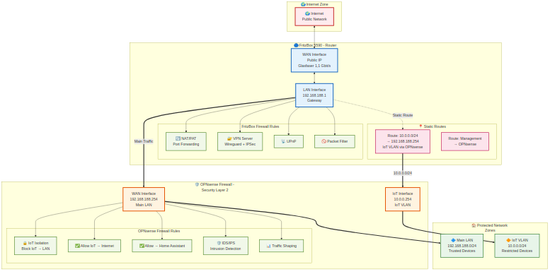

# 🔒 Firewall & Routing Konfiguration

> **Detaillierte Firewall-Regeln und Routing-Setup**
> [← Zurück zur Hauptdokumentation](HAUPTDOKUMENTATION.md)

## 🛡️ Firewall-Architektur



## 📋 FritzBox Static Routes

| Ziel-Netzwerk | Subnetzmaske | Gateway | Interface | Beschreibung |
|---------------|--------------|---------|-----------|--------------|
| 10.0.0.0 | 255.255.255.0 | 192.168.188.254 | LAN | IoT VLAN via OPNsense |

## 🌐 Web-Interface Zugriff

**OPNsense Web-GUI Zugriff über alle Interfaces**

### Konfiguration in OPNsense:

**System → Settings → Administration**

| Setting | Wert | Beschreibung |
|---------|------|--------------|
| **Listen Interfaces** | All (LAN, WAN, IoT VLAN) | Web-GUI auf allen Interfaces verfügbar |
| **Protocol** | HTTPS | Sichere Verbindung |
| **TCP Port** | 443 | Standard HTTPS Port |
| **HTTP Redirect** | ✅ Enabled | HTTP → HTTPS Weiterleitung |
| **Disable DNS Rebinding Checks** | ✅ Optional | Für lokale Domains (*.mrz.ip) |

### Zugriffsmöglichkeiten:

| Interface | URL | IP-Adresse | Zugriff von |
|-----------|-----|------------|-------------|
| **LAN (Main)** | https://opensence.mrz.ip/ | https://192.168.188.254/ | Hauptnetzwerk |
| **IoT VLAN** | https://10.0.0.254/ | https://10.0.0.254/ | IoT-Geräte |
| **WAN** | ❌ Deaktiviert | - | Aus Sicherheitsgründen |

### Sicherheitshinweise:
- ⚠️ **WAN-Zugriff deaktiviert lassen** (aus Sicherheitsgründen)
- ✅ **Starkes Admin-Passwort** verwenden
- ✅ **2FA aktivieren** (empfohlen)
- ✅ **IP-Whitelist** für sensible Interfaces (optional)

---

## 🔐 SSH-Zugriff Konfiguration

**SSH-Zugriff auf OPNsense über alle Interfaces**

### Konfiguration in OPNsense:

**System → Settings → Administration → Secure Shell**

| Setting | Wert | Beschreibung |
|---------|------|--------------|
| **Enable Secure Shell** | ✅ Enabled | SSH-Server aktivieren |
| **Listen Interfaces** | LAN, IoT VLAN | SSH auf ausgewählten Interfaces |
| **SSH Port** | 22 | Standard SSH Port (änderbar) |
| **Permit Root Login** | ✅ Yes | Root-Login erlauben |
| **Permit Password Login** | ✅ Yes | Passwort-Login erlauben |
| **SSH Key Only** | ⚠️ Optional | Nur Key-basierte Auth (empfohlen) |

### SSH-Zugriff von verschiedenen Netzwerken:

| Interface | IP-Adresse | SSH-Befehl | Zugriff von |
|-----------|------------|------------|-------------|
| **LAN (Main)** | 192.168.188.254 | `ssh root@opensence.mrz.ip`<br/>`ssh root@192.168.188.254` | Hauptnetzwerk |
| **IoT VLAN** | 10.0.0.254 | `ssh root@10.0.0.254` | IoT-Geräte |
| **WAN** | ❌ Deaktiviert | - | Aus Sicherheitsgründen |

### SSH-Key Setup (empfohlen):

**1. SSH-Key generieren (auf Client):**
```bash
ssh-keygen -t ed25519 -C "opnsense-access"
```

**2. Public Key auf OPNsense kopieren:**
```bash
ssh-copy-id root@opensence.mrz.ip
# oder manuell:
cat ~/.ssh/id_ed25519.pub | ssh root@opensence.mrz.ip 'cat >> ~/.ssh/authorized_keys'
```

**3. Passwort-Login deaktivieren (optional, für mehr Sicherheit):**
- System → Settings → Administration → Secure Shell
- **Permit Password Login**: ❌ Disabled

### Firewall-Regeln für SSH:

**Automatisch erstellt, wenn SSH aktiviert ist:**

| Interface | Regel | Beschreibung |
|-----------|-------|--------------|
| LAN | Allow SSH (TCP 22) → OPNsense | SSH-Zugriff vom LAN |
| IoT VLAN | Allow SSH (TCP 22) → OPNsense | SSH-Zugriff vom IoT VLAN |
| WAN | ❌ Block SSH | Kein SSH von außen |

### Verwendung der Dokumentations-Scripts via SSH:

```bash
# OPNsense-Konfiguration exportieren
ssh root@opensence.mrz.ip 'sh' < generate-opnsense-documentation.sh > opnsense-export.md

# Direkt auf OPNsense ausführen
scp generate-opnsense-documentation.sh root@opensence.mrz.ip:/tmp/
ssh root@opensence.mrz.ip "/tmp/generate-opnsense-documentation.sh"
```

### Sicherheitsempfehlungen:

- ✅ **SSH-Keys verwenden** statt Passwort
- ✅ **SSH-Port ändern** (z.B. 2222) für zusätzliche Sicherheit
- ✅ **Fail2Ban aktivieren** gegen Brute-Force-Angriffe
- ⚠️ **WAN-SSH niemals aktivieren** (Sicherheitsrisiko!)
- ✅ **IP-Whitelist** einrichten für kritische Zugriffe
- ✅ **Regelmäßig Logs prüfen**: System → Log Files → General

---

## 🌍 Internet-Zugriff Prüfung & Diagnose

**Methoden zur Überprüfung der Internet-Konnektivität**

### 🔍 Diagnose-Tools in OPNsense

**Interfaces → Diagnostics → Ping**

| Ziel | IP/Domain | Zweck |
|------|-----------|-------|
| **DNS Test** | 8.8.8.8 | Prüft Grund-Konnektivität |
| **Domain Test** | google.com | Prüft DNS-Auflösung |
| **Cloudflare** | 1.1.1.1 | Alternative DNS-Prüfung |
| **Lokales Gateway** | 192.168.188.1 | Prüft Router-Verbindung |

**Interfaces → Diagnostics → Traceroute**
- Zeigt den Weg der Pakete zum Ziel
- Identifiziert, wo Verbindungen scheitern

**Interfaces → Diagnostics → DNS Lookup**
- Testet DNS-Auflösung
- Prüft welcher DNS-Server antwortet

### 📊 Verbindungsprüfung über CLI (SSH)

```bash
# Ping Test
ping -c 4 8.8.8.8           # Google DNS
ping -c 4 1.1.1.1           # Cloudflare DNS
ping -c 4 google.com        # Domain-Test (prüft auch DNS)

# DNS-Auflösung testen
host google.com
nslookup google.com
dig google.com

# Routing-Tabelle anzeigen
netstat -rn

# Interface-Status prüfen
ifconfig
ifconfig -a | grep "status"

# Gateway-Test
ping -c 4 192.168.188.1     # FritzBox

# Traceroute
traceroute 8.8.8.8
```

### 🔧 Häufige Internet-Probleme & Lösungen

#### Problem 1: Kein Internet-Zugriff
```bash
# Diagnose-Schritte:
1. ping 192.168.188.1       # Lokales Gateway erreichbar?
2. ping 192.168.188.254     # OPNsense erreichbar?
3. ping 8.8.8.8             # Internet-IP erreichbar?
4. ping google.com          # DNS funktioniert?
```

**Mögliche Ursachen:**
- ❌ Gateway falsch konfiguriert
- ❌ Firewall-Regel blockiert Traffic
- ❌ NAT nicht aktiv
- ❌ DNS nicht konfiguriert

#### Problem 2: DNS funktioniert nicht
```bash
# DNS-Test:
nslookup google.com 8.8.8.8     # Direkter DNS-Test
host -t A google.com 1.1.1.1    # Alternative DNS-Abfrage
```

**Lösung:**
- OPNsense → System → Settings → General
- DNS Servers prüfen: 1.1.1.1, 8.8.8.8

#### Problem 3: Nur bestimmte Geräte haben kein Internet

**Firewall-Regeln prüfen:**
- Firewall → Rules → LAN/IoT VLAN
- Regel "Allow to Internet" vorhanden?
- Regel aktiviert? (✅ grün)

### 📈 Live-Monitoring

**Firewall → Log Files → Live View**
- Zeigt blockierte/erlaubte Verbindungen in Echtzeit
- Filtere nach Source IP/Destination

**Interfaces → Diagnostics → Packet Capture**
- Vollständige Packet-Analyse
- Für tiefgreifende Probleme

### ✅ Checkliste: Internet-Zugriff funktioniert

- [ ] **Ping zu Gateway** (192.168.188.1) erfolgreich
- [ ] **Ping zu OPNsense** (192.168.188.254) erfolgreich
- [ ] **Ping zu 8.8.8.8** erfolgreich
- [ ] **Ping zu google.com** erfolgreich
- [ ] **DNS-Auflösung** funktioniert
- [ ] **Firewall-Regeln** erlauben Traffic
- [ ] **NAT** ist aktiviert
- [ ] **Default Gateway** korrekt gesetzt

### 🚨 Schnelltest-Script

```bash
#!/bin/bash
# Internet-Diagnose-Script für OPNsense

echo "🔍 Internet-Konnektivitäts-Test"
echo "================================"
echo ""

echo "1. Gateway-Test (FritzBox):"
ping -c 2 192.168.188.1 && echo "✅ Gateway OK" || echo "❌ Gateway FAIL"
echo ""

echo "2. OPNsense-Test:"
ping -c 2 192.168.188.254 && echo "✅ OPNsense OK" || echo "❌ OPNsense FAIL"
echo ""

echo "3. Internet-IP-Test (Google DNS):"
ping -c 2 8.8.8.8 && echo "✅ Internet OK" || echo "❌ Internet FAIL"
echo ""

echo "4. DNS-Test (google.com):"
ping -c 2 google.com && echo "✅ DNS OK" || echo "❌ DNS FAIL"
echo ""

echo "5. Routing-Info:"
netstat -rn | grep default
echo ""

echo "Test abgeschlossen!"
```

**Verwendung:**
```bash
ssh root@opensence.mrz.ip 'sh' < internet-test.sh
```

---

## 🌐 DNS-Konfiguration in OPNsense

**System → Settings → General**

### DNS Server Einstellungen

| Priorität | DNS Server | IP-Adresse | Beschreibung |
|-----------|------------|------------|--------------|
| **Primary** | Pi-hole | 192.168.188.2 | Lokaler DNS mit Ad-Blocking |
| **Secondary** | Cloudflare | 1.1.1.1 | Fallback DNS (schnell, privat) |
| **Tertiary** | Google DNS | 8.8.8.8 | Zweiter Fallback DNS |

### DNS Resolver/Forwarder

**Services → Unbound DNS → General**

| Setting | Wert | Beschreibung |
|---------|------|--------------|
| **Enable** | ✅ Enabled | DNS Resolver aktivieren |
| **Listen Port** | 53 | Standard DNS Port |
| **Network Interfaces** | LAN, IoT VLAN | DNS auf beiden Netzwerken |
| **DNSSEC** | ✅ Enabled | DNS-Sicherheit aktivieren |
| **DNS Query Forwarding** | ✅ Enabled | Forward zu Pi-hole |
| **Use System Nameservers** | ✅ Enabled | System DNS verwenden (Pi-hole) |

### DNS-Konfiguration pro Netzwerk

**Services → DHCPv4 → [LAN/IoT_VLAN]**

| Netzwerk | DHCP DNS Server | Beschreibung |
|----------|-----------------|--------------|
| **Main LAN** | 192.168.188.2 (Pi-hole) | Primärer DNS für alle LAN-Clients |
| **IoT VLAN** | 10.0.0.254 (OPNsense) | OPNsense leitet an Pi-hole weiter |

### DNS-Test & Verifizierung

**Auf OPNsense (SSH):**
```bash
# DNS-Auflösung testen
nslookup google.com
nslookup google.com 192.168.188.2  # Direkt Pi-hole
nslookup google.com 1.1.1.1         # Direkt Cloudflare

# DNS-Server prüfen
cat /etc/resolv.conf

# DNS-Cache leeren (falls nötig)
unbound-control flush_zone .
unbound-control reload
```

**Von Client (Main LAN):**
```bash
# Welcher DNS wird verwendet?
nslookup google.com
# Server: 192.168.188.2 (sollte Pi-hole sein)

# DNS-Performance testen
dig google.com | grep "Query time"
```

**Von IoT-Gerät (IoT VLAN):**
```bash
# IoT-Geräte sollten OPNsense als DNS bekommen
nslookup google.com
# Server: 10.0.0.254 (OPNsense, leitet an Pi-hole weiter)
```

### Troubleshooting DNS

#### Problem: DNS funktioniert nicht
```bash
# 1. OPNsense DNS-Status prüfen
service unbound status
service unbound restart

# 2. Pi-hole erreichbar?
ping -c 3 192.168.188.2

# 3. DNS-Auflösung direkt testen
nslookup google.com 192.168.188.2
```

#### Problem: Langsame DNS-Auflösung
- **Lösung 1**: DNS-Cache in OPNsense aktivieren
- **Lösung 2**: Pi-hole DNS-Cache prüfen
- **Lösung 3**: Upstream DNS-Server wechseln (1.1.1.1 schneller als 8.8.8.8)

#### Problem: IoT-Geräte haben kein DNS
- **Prüfen**: DHCP-Server im IoT VLAN aktiv?
- **Prüfen**: DNS-Server in DHCP-Optionen konfiguriert?
- **Prüfen**: Firewall-Regel erlaubt DNS (Port 53)?

### DNS-Sicherheit

- ✅ **DNSSEC aktivieren** - Verhindert DNS-Spoofing
- ✅ **Pi-hole nur von OPNsense erreichbar** - Firewall-Regel
- ✅ **DoH/DoT optional** - Verschlüsselte DNS-Anfragen
- ⚠️ **DNS-Leaks vermeiden** - VPN-Clients sollten OPNsense DNS nutzen

---

## 🔥 OPNsense Firewall Rules

### IoT VLAN Security Rules

**Firewall → Rules → IoT_VLAN**

| # | Aktion | Quelle | Ziel | Port/Protokoll | Beschreibung |
|---|--------|--------|------|----------------|--------------|
| 1 | ✅ Allow | IoT VLAN | Any | DNS (53 UDP/TCP) | DNS-Auflösung (zu Pi-hole + Internet) |
| 2 | ✅ Allow | IoT VLAN | Any | NTP (123 UDP) | Zeit-Synchronisation |
| 3 | ✅ Allow | IoT VLAN | Any | MQTT (1883 TCP) | MQTT Broker (unverschlüsselt) |
| 4 | ✅ Allow | IoT VLAN | Any | MQTTS (8883 TCP) | MQTT Broker (TLS verschlüsselt) |
| 5 | ✅ Allow | IoT VLAN | 192.168.188.178 | 8123 | Home Assistant Zugriff |
| 6 | ✅ Allow | Main LAN (192.168.188.0/24) | IoT VLAN | * | Management-Zugriff von LAN |
| 7 | 🚫 Block | IoT VLAN | 192.168.188.0/24 | * | Blockiere IoT → Main LAN |
| 8 | 🚫 Block | IoT VLAN | Pi-hole (192.168.188.2) | !DNS | Schütze DNS Server (außer DNS) |
| 9 | 🚫 Block | IoT VLAN | Proxmox (192.168.188.177) | * | Schütze Virtualisierung |

**Wichtig:** Regel-Reihenfolge beachten! Spezifische Allow-Regeln vor Block-Regeln.

### Main LAN Security Rules

**Firewall → Rules → LAN**

| # | Aktion | Quelle | Ziel | Port | Beschreibung |
|---|--------|--------|------|------|--------------|
| 1 | ✅ Allow | Main LAN (192.168.188.0/24) | Any | * | **Voller Zugriff überall** |
| 2 | ✅ Allow | Main LAN | IoT VLAN (10.0.0.0/24) | * | IoT-Geräte Management |
| 3 | ✅ Allow | Main LAN | Internet | * | Voller Internet-Zugriff |
| 4 | ✅ Allow | Main LAN | Lokale Netze | * | Internes Netzwerk |

**Sicherheitskonzept:**
- ✅ Main LAN = **Vertrauenswürdiges Netzwerk** → Voller Zugriff
- ⚠️ IoT VLAN = **Eingeschränktes Netzwerk** → Nur notwendige Dienste

## Security Features

### FritzBox (Layer 1)
- ✅ Stateful Packet Inspection (SPI)
- ✅ DoS Protection
- ✅ VPN Server (Wireguard + IPSec)
- ✅ UPnP (kontrolliert)
- ✅ IPv6 Firewall
- ❌ DMZ deaktiviert

### OPNsense (Layer 2)
- ✅ Deep Packet Inspection
- ✅ IDS/IPS
- ✅ VLAN Segmentation
- ✅ Traffic Shaping & QoS
- ✅ Connection Tracking
- ✅ GeoIP Blocking (optional)

[← Zurück zur Hauptdokumentation](HAUPTDOKUMENTATION.md)
