# 🏠 WG Merzhauser - Netzwerk Infrastrukturdokumentation

> **Vollständige Dokumentation der Heimnetz-Infrastruktur**  
> Erstellt am: 19. November 2025  
> Server: Julian Wiche Netzwerk

---

## 📋 Inhaltsverzeichnis

1. [🌐 Netzwerk-Übersicht](#-netzwerk-übersicht)
2. [🔌 Switch-Konfiguration](#-switch-konfiguration)
3. [📡 IP-Adressen & Geräte](#-ip-adressen--geräte)
4. [🔒 VPN-Verbindungen](#-vpn-verbindungen)
5. [💻 Proxmox-Infrastruktur](#-proxmox-infrastruktur)
6. [🌐 Web-Interfaces](#-web-interfaces)
7. [📊 Automatisierung](#-automatisierung)

---

## 🌐 Netzwerk-Übersicht

### 🏗️ Infrastructure-Diagramm


---

## 🔌 Switch-Konfiguration

### Zyxel XGS1210-12 Port-Übersicht

```mermaid
graph LR
    subgraph "Zyxel XGS1210-12 Switch Ports"
        P1[🔌 Port 1<br/>FritzBox<br/>VLAN 4<br/>192.168.188.1]
        P2[🔌 Port 2<br/>Schrank Switch<br/>VLAN 1+4<br/>Uplink]
        P3[🔌 Port 3<br/>Zigbee Pi<br/>VLAN 1<br/>Home Assistant]
        P4[🔌 Port 4<br/>Onkyo Receiver<br/>VLAN 1<br/>192.168.188.173]
        P5[🔌 Port 5<br/>RetroPie<br/>VLAN 1<br/>Gaming]
        P6[🔌 Port 6<br/>🆓 FREI<br/>Available]
        P7[🔌 Port 7<br/>🆓 FREI<br/>Available]
        P8[🔌 Port 8<br/>🆓 FREI<br/>Available]
        P9[🔌 Port 9<br/>FireTV<br/>VLAN 1<br/>192.168.188.149]
        P10[🔌 Port 10<br/>Pi-hole<br/>VLAN 1<br/>192.168.188.2]
        P11[🔌 Port 11<br/>PC "jul"<br/>VLAN 1<br/>Main PC]
        P12[🔌 Port 12<br/>❓ Unbekannt<br/>Unknown Device]
        
        %% Connections
        FRITZBOX_CONN[📡 FritzBox 5590] --> P1
        SCHRANK[🔧 Schrank Switch] --> P2
        ZIGBEE[🏠 Zigbee Hub] --> P3
        ONKYO_CONN[🔊 AV Receiver] --> P4
        RETROPIE[🎮 Gaming System] --> P5
        FIRETV_CONN[📺 Media Player] --> P9
        PIHOLE_CONN[🔴 DNS Server] --> P10
        PC_JUL[💻 Main Computer] --> P11
    end

    %% Port Status Styling
    classDef activePort fill:#c8e6c9,stroke:#4caf50,stroke-width:2px
    classDef freePort fill:#fff3e0,stroke:#ff9800,stroke-width:2px
    classDef unknownPort fill:#ffebee,stroke:#f44336,stroke-width:2px
    classDef managementPort fill:#e3f2fd,stroke:#2196f3,stroke-width:2px

    class P1 managementPort
    class P2,P3,P4,P5,P9,P10,P11 activePort
    class P6,P7,P8 freePort
    class P12 unknownPort
```

### 📊 Port-Zuordnungstabelle

| Port | Gerät | IP-Adresse | VLAN | Status | MAC-Adresse |
|------|-------|------------|------|--------|-------------|
| 1 | FritzBox 5590 | 192.168.188.1 | VLAN 4 | ✅ Aktiv | 0C:72:74:AE:64:EB |
| 2 | Schrank-Switch | - | VLAN 1+4 | ✅ Aktiv | - |
| 3 | Zigbee Pi (Home Assistant) | 192.168.188.178 | VLAN 1 | ✅ Aktiv | 02:65:CD:22:E0:F0 |
| 4 | Onkyo Receiver | 192.168.188.173 | VLAN 1 | ✅ Aktiv | 00:09:B0:E6:C1:95 |
| 5 | RetroPie | - | VLAN 1 | ✅ Aktiv | - |
| 6 | **FREI** | - | - | ❌ Verfügbar | - |
| 7 | **FREI** | - | - | ❌ Verfügbar | - |
| 8 | **FREI** | - | - | ❌ Verfügbar | - |
| 9 | FireTV Julian | 192.168.188.149 | VLAN 1 | ✅ Aktiv | 00:00:00:00:02:BB |
| 10 | Pi-hole DNS | 192.168.188.2 | VLAN 1 | ✅ Aktiv | D8:3A:DD:3B:90:FF |
| 11 | PC "jul" | - | VLAN 1 | ✅ Aktiv | - |
| 12 | Unbekanntes Gerät | - | - | ❓ Unbekannt | - |

---

## 📡 IP-Adressen & Geräte

### 🔧 Core Infrastructure

| IP-Adresse | Hostname | Beschreibung | Typ | MAC-Adresse |
|------------|----------|--------------|-----|-------------|
| `192.168.188.1` | box.mrz.ip | FritzBox 5590 Fiber Router | Router | 0C:72:74:AE:64:EB |
| `192.168.188.2` | pihole.mrz.ip / wg.weis.er | Pi-hole DNS Server | DNS | D8:3A:DD:3B:90:FF |
| `192.168.188.254` | openSence.mrz.ip | OPNsense Firewall | Firewall | BC:24:11:D0:7E:E6 |
| `10.0.0.254` | - | IoT VLAN Gateway | Gateway | - |

### 💻 Server & Virtualisierung

| IP-Adresse | Hostname | Beschreibung | MAC-Adresse |
|------------|----------|--------------|-------------|
| `192.168.188.3` | proxmox-turbo-2-5-gbit | Proxmox Turbo Server | 5C:85:7E:3E:F3:1E |
| `192.168.188.177` | pve | Proxmox VE Hauptserver | 1C:69:7A:0A:2A:73 |
| `192.168.188.156` | pve-backup.mrz.ip | Proxmox Backup Server | BC:24:11:9B:AB:A7 |
| `192.168.188.179` | proxmox-docker | Proxmox Docker Host | BC:24:11:73:BF:DF |
| `192.168.188.178` | homeassistant-VM | Home Assistant VM | 02:65:CD:22:E0:F0 |

### 🌐 Netzwerk-Equipment

| IP-Adresse | Hostname | Beschreibung | MAC-Adresse |
|------------|----------|--------------|-------------|
| `192.168.188.54` | core-switch | Core Switch | FC:22:F4:EC:15:B1 |
| `192.168.188.57` | helper-switch | Helper Switch | D8:EC:5E:5B:7B:91 |
| `192.168.188.61` | Unify-U6-Pro | UniFi Access Point | D8:B3:70:2D:48:A0 |
| `192.168.188.79` | ap.mrz.ip | FritzBox 7490 Access Point | 08:96:D7:94:05:53 |

### 📱 Smart Home & IoT

| IP-Adresse | Hostname | Beschreibung | MAC-Adresse |
|------------|----------|--------------|-------------|
| `192.168.188.20` | shellyuni | Shelly Uni | A8:03:2A:B6:18:B0 |
| `192.168.188.24` | shelly1-monitor | Shelly Monitor | 48:55:19:CA:22:2F |
| `192.168.188.88` | shellyuni-98CDAC2B78CF | Shelly Uni | 98:CD:AC:2B:78:CF |
| `192.168.188.97` | shelly-spiegelleuchte | Shelly Spiegelleuchte | 98:CD:AC:2D:5C:EA |
| `192.168.188.113` | geschirrspuehler-siemens | Geschirrspüler (WLAN 5GHz) | C8:D7:78:9B:F1:46 |
| `192.168.188.123` | shelly1-universum | Shelly Universum | 98:CD:AC:2D:5E:4E |
| `192.168.188.155` | shellyix3-JULIAN-LICHTSCHALTER | Shelly Lichtschalter | E8:DB:84:D6:C6:37 |

### 📺 Media & Entertainment

| IP-Adresse | Hostname | Beschreibung | MAC-Adresse |
|------------|----------|--------------|-------------|
| `192.168.188.73` | JulianPhillipsTV | Philips TV | 0C:CA:FB:17:A6:4A |
| `192.168.188.96` | volumio | Volumio Audio System | D8:3A:DD:B4:43:B1 |
| `192.168.188.102` | amazon-firetv-wohnzimmer | FireTV Wohnzimmer | C8:4D:44:35:D2:DE |
| `192.168.188.149` | amazon-firetv-julian | FireTV Julian | 00:00:00:00:02:BB |
| `192.168.188.162` | sony-receiver | Sony Receiver | D8:D4:3C:4A:47:3D |
| `192.168.188.173` | onkyo-mrz-ip | Onkyo Receiver | 00:09:B0:E6:C1:95 |

---

## 🔒 VPN-Verbindungen

### VPN-Übersicht

```mermaid
graph TB
    subgraph "VPN-Infrastruktur"
        FRITZBOX_VPN[🔵 FritzBox 5590<br/>VPN Server<br/>192.168.188.1]
        
        subgraph "Wireguard VPN (192.168.188.205-219)"
            WG1[💻 JulSrv1000<br/>192.168.188.205]
            WG2[💻 JulSrvNew<br/>192.168.188.207]
            WG3[💻 ArbeitslaptopLinux<br/>192.168.188.208]
            WG4[💻 Arbeitslaptop<br/>192.168.188.209]
            WG5[📱 JuliansHandy<br/>192.168.188.210]
            WG6[💻 RomisExKrikoLaptop<br/>192.168.188.211]
            WG7[🧪 TestClone<br/>192.168.188.212]
            WG8[🧪 TestClone2<br/>192.168.188.213]
            WG9[🌐 new.julianw.de<br/>192.168.188.214]
            WG10[📱 juli-ueberall<br/>192.168.188.215]
            WG11[💻 Dell Precision 2025<br/>192.168.188.216]
            WG12[💻 New Work Laptop<br/>192.168.188.217]
            WG13[🧪 Test Client<br/>192.168.188.218]
            WG14[💻 Dell Precision 5550<br/>192.168.188.219]
        end
        
        subgraph "IPSec VPN (192.168.188.201-206)"
            IPSEC1[🖥️ JulSrv<br/>192.168.188.201]
            IPSEC2[👤 Johannes Fries<br/>192.168.188.202]
            IPSEC3[👤 julian<br/>192.168.188.203]
            IPSEC4[📱 Box2Go<br/>192.168.188.204]
            IPSEC5[🌐 Lisasupertramp.de<br/>192.168.188.206]
        end
        
        FRITZBOX_VPN --> WG1
        FRITZBOX_VPN --> WG2
        FRITZBOX_VPN --> WG3
        FRITZBOX_VPN --> WG4
        FRITZBOX_VPN --> WG5
        FRITZBOX_VPN --> WG6
        FRITZBOX_VPN --> WG7
        FRITZBOX_VPN --> WG8
        FRITZBOX_VPN --> WG9
        FRITZBOX_VPN --> WG10
        FRITZBOX_VPN --> WG11
        FRITZBOX_VPN --> WG12
        FRITZBOX_VPN --> WG13
        FRITZBOX_VPN --> WG14
        
        FRITZBOX_VPN --> IPSEC1
        FRITZBOX_VPN --> IPSEC2
        FRITZBOX_VPN --> IPSEC3
        FRITZBOX_VPN --> IPSEC4
        FRITZBOX_VPN --> IPSEC5
    end

    classDef wireguardClass fill:#e8f5e8,stroke:#4caf50,stroke-width:2px
    classDef ipsecClass fill:#e3f2fd,stroke:#2196f3,stroke-width:2px
    classDef serverClass fill:#fff3e0,stroke:#ff9800,stroke-width:3px

    class WG1,WG2,WG3,WG4,WG5,WG6,WG7,WG8,WG9,WG10,WG11,WG12,WG13,WG14 wireguardClass
    class IPSEC1,IPSEC2,IPSEC3,IPSEC4,IPSEC5 ipsecClass
    class FRITZBOX_VPN serverClass
```



### 📋 VPN-Client-Tabellen

#### Wireguard VPN-Clients
| VPN-IP | Client-Name | Typ | Beschreibung |
|--------|-------------|-----|--------------|
| 192.168.188.205 | JulSrv1000 | Server | Server 1000 |
| 192.168.188.207 | JulSrvNew | Server | Neuer Server |
| 192.168.188.208 | ArbeitslaptopLinux | Laptop | Work Laptop Linux |
| 192.168.188.209 | Arbeitslaptop | Laptop | Work Laptop |
| 192.168.188.210 | JuliansHandy | Mobile | Julian's Phone |
| 192.168.188.211 | RomisExKrikoLaptop | Laptop | Romi's Laptop |
| 192.168.188.212 | JulianW.de-TestfutureClone | Test | Test Clone |
| 192.168.188.213 | JulianwDeTestClone2 | Test | Test Clone 2 |
| 192.168.188.214 | new.julianw.de | Server | New Server |
| 192.168.188.215 | juli-ueberall | Mobile | Julian Mobile |
| 192.168.188.216 | neuerDellPrecsicion2025 | Laptop | Dell Precision 2025 |
| 192.168.188.217 | ArbeitsLaptopNeu | Laptop | New Work Laptop |
| 192.168.188.218 | ttt | Test | Test Client |
| 192.168.188.219 | NeuerDellPrecsicion5550 | Laptop | Dell Precision 5550 |

#### IPSec VPN-Clients
| VPN-IP | Client-Name | Typ | Beschreibung |
|--------|-------------|-----|--------------|
| 192.168.188.201 | JulSrv | Server | Hauptserver |
| 192.168.188.202 | Johannes Fries | User | Johannes |
| 192.168.188.203 | julian | User | Julian |
| 192.168.188.204 | Box2Go | Mobile | Mobile Box |
| 192.168.188.206 | Lisasupertramp.de | Server | Lisa's Server |

---

## 💻 Proxmox-Infrastruktur

### Proxmox-Cluster Übersicht

```mermaid
graph TB
    subgraph "Proxmox Infrastructure"
        CLUSTER[🏢 Proxmox Cluster<br/>homelab]
        
        %% Nodes
        NODE1[🖥️ pve (192.168.188.177)<br/>Status: online<br/>Uptime: 15+ days<br/>Web: https://192.168.188.177:8006/]
        NODE2[🖥️ pve-backup (192.168.188.156)<br/>Status: online<br/>Backup Node<br/>Storage Focus]
        NODE3[🖥️ proxmox-docker (192.168.188.179)<br/>Status: online<br/>Container Focus]
        
        CLUSTER --> NODE1
        CLUSTER --> NODE2  
        CLUSTER --> NODE3
        
        %% VMs
        VM100[🖥️ VM 100: ubuntu-server<br/>Status: running<br/>OS: ubuntu<br/>RAM: 4GB, CPU: 4 Cores]
        VM101[🖥️ VM 101: windows-10<br/>Status: stopped<br/>OS: win10<br/>RAM: 8GB, CPU: 6 Cores]
        VM102[🖥️ VM 102: opnsense<br/>Status: running<br/>OS: firewall<br/>RAM: 2GB, CPU: 2 Cores]
        
        NODE1 --> VM100
        NODE1 --> VM101
        NODE1 --> VM102
        
        %% LXC Containers
        LXC200[📦 CT 200: docker-host<br/>Status: running<br/>OS: ubuntu<br/>RAM: 2GB, CPU: 2 Cores]
        LXC201[📦 CT 201: web-server<br/>Status: running<br/>OS: debian<br/>RAM: 1GB, CPU: 2 Cores]
        LXC202[📦 CT 202: home-assistant<br/>Status: running<br/>OS: debian<br/>RAM: 1GB, CPU: 1 Core]
        LXC203[📦 CT 203: pihole-backup<br/>Status: stopped<br/>OS: debian<br/>RAM: 512MB, CPU: 1 Core]
        
        NODE1 --> LXC200
        NODE1 --> LXC201
        NODE2 --> LXC202
        NODE2 --> LXC203
        
        %% Storage
        STORAGE1[💾 local<br/>Type: dir<br/>Content: iso,backup]
        STORAGE2[💾 local-lvm<br/>Type: lvmthin<br/>Content: images,rootdir]
        STORAGE3[💾 backup-nfs<br/>Type: nfs<br/>Content: backup]
        
        CLUSTER --> STORAGE1
        CLUSTER --> STORAGE2
        CLUSTER --> STORAGE3
        
        %% Network
        NET1[🌐 vmbr0<br/>192.168.188.0/24<br/>Main Network]
        NET2[🌐 vmbr1<br/>10.0.0.0/24<br/>IoT Network]
        NET3[🌐 vmbr2<br/>Isolated<br/>DMZ Network]
        
        CLUSTER --> NET1
        CLUSTER --> NET2
        CLUSTER --> NET3
    end

    classDef vmClass fill:#e1f5fe,stroke:#01579b,stroke-width:2px
    classDef lxcClass fill:#f3e5f5,stroke:#4a148c,stroke-width:2px
    classDef nodeClass fill:#e8f5e8,stroke:#1b5e20,stroke-width:2px
    classDef storageClass fill:#fff3e0,stroke:#e65100,stroke-width:2px
    classDef clusterClass fill:#fce4ec,stroke:#880e4f,stroke-width:3px
    classDef networkClass fill:#f1f8e9,stroke:#33691e,stroke-width:2px

    class VM100,VM101,VM102 vmClass
    class LXC200,LXC201,LXC202,LXC203 lxcClass
    class NODE1,NODE2,NODE3 nodeClass
    class STORAGE1,STORAGE2,STORAGE3 storageClass
    class CLUSTER clusterClass
    class NET1,NET2,NET3 networkClass
```

### 📊 Proxmox Ressourcen-Übersicht

#### Virtual Machines
| VMID | Name | Status | Memory | CPU | Storage | OS |
|------|------|--------|--------|-----|---------|-----|
| 100 | ubuntu-server | ✅ running | 4096MB | 4 Cores | local-lvm | ubuntu |
| 101 | windows-10 | ⏸️ stopped | 8192MB | 6 Cores | local-lvm | win10 |
| 102 | opnsense-firewall | ✅ running | 2048MB | 2 Cores | local-lvm | other |

#### LXC Containers
| CTID | Name | Status | Memory | CPU | Storage | OS |
|------|------|--------|--------|-----|---------|-----|
| 200 | docker-host | ✅ running | 2048MB | 2 Cores | local-lvm | ubuntu |
| 201 | web-server | ✅ running | 1024MB | 2 Cores | local-lvm | debian |
| 202 | home-assistant | ✅ running | 1024MB | 1 Core | local-lvm | debian |
| 203 | pihole-backup | ⏸️ stopped | 512MB | 1 Core | local-lvm | debian |

---

## 🌐 Web-Interfaces

### 🔧 Management-URLs

| Service | URL | IP-Adresse | Beschreibung | Zugangsdaten |
|---------|-----|------------|--------------|--------------|
| **FritzBox Router** | http://192.168.188.1/ | 192.168.188.1 | Router-Management | Web-Interface |
| **Pi-hole DNS** | http://wg.weis.er/ | 192.168.188.2 | DNS-Management | Admin-Panel |
| **Reverse Proxy** | http://proxy.mrz.ip/ | TBD | Proxy-Management | Load Balancer |
| **Proxmox VE** | https://192.168.188.177:8006/ | 192.168.188.177 | Virtualisierung | Web-Console |
| **OPNsense Firewall** | http://openSence.mrz.ip/ | 192.168.188.254 | Firewall-Management | Web-GUI |
| **IoT VLAN Gateway** | http://10.0.0.254/ | 10.0.0.254 | IoT-Management | Gateway-Config |

### 📱 Quick-Access Dashboard

```mermaid
graph LR
    subgraph "Management Dashboard"
        DASHBOARD[🎛️ Network Control Center]
        
        ROUTER[🔵 Router<br/>FritzBox<br/>192.168.188.1]
        DNS[🔴 DNS<br/>Pi-hole<br/>wg.weis.er]
        PROXY[🟡 Proxy<br/>Reverse Proxy<br/>proxy.mrz.ip]
        PROXMOX[🟢 Virtualization<br/>Proxmox<br/>:8006]
        FIREWALL[🟠 Security<br/>OPNsense<br/>:254]
        
        DASHBOARD --> ROUTER
        DASHBOARD --> DNS
        DASHBOARD --> PROXY
        DASHBOARD --> PROXMOX
        DASHBOARD --> FIREWALL
        
        %% Quick Actions
        ROUTER --> ROUTER_ACTIONS[📊 Bandwidth Monitor<br/>🔒 Port Forwarding<br/>📱 Device Management]
        DNS --> DNS_ACTIONS[🚫 Block Lists<br/>📈 Query Analytics<br/>⚙️ Local DNS]
        PROXY --> PROXY_ACTIONS[🔄 Load Balancing<br/>🔒 SSL Termination<br/>🎯 Service Routing]
        PROXMOX --> PROXMOX_ACTIONS[🖥️ VM Management<br/>📦 Container Control<br/>💾 Backup Monitor]
        FIREWALL --> FIREWALL_ACTIONS[🔥 Traffic Rules<br/>🛡️ Intrusion Detection<br/>📊 Threat Analysis]
    end

    classDef dashboardClass fill:#f8f9fa,stroke:#343a40,stroke-width:3px
    classDef serviceClass fill:#e3f2fd,stroke:#1976d2,stroke-width:2px
    classDef actionClass fill:#f1f8e9,stroke:#388e3c,stroke-width:1px

    class DASHBOARD dashboardClass
    class ROUTER,DNS,PROXY,PROXMOX,FIREWALL serviceClass
    class ROUTER_ACTIONS,DNS_ACTIONS,PROXY_ACTIONS,PROXMOX_ACTIONS,FIREWALL_ACTIONS actionClass
```



---

## 📊 Automatisierung

### 🤖 Proxmox Auto-Documentation Script

Das Repository enthält ein automatisiertes Script zur Generierung der Proxmox-Dokumentation:

#### Script-Features:
- **Automatische Erkennung** aller VMs und LXC Container
- **Mermaid-Diagramm-Generierung** der gesamten Infrastruktur
- **Detaillierte Tabellen** mit Hardware-Konfiguration
- **Storage- und Netzwerk-Analyse**
- **Cluster-Status-Monitoring**

#### Verwendung:
```bash
# Auf Proxmox-Server ausführen
chmod +x generate-proxmox-documentation.sh
./generate-proxmox-documentation.sh

# Generiert: proxmox.md mit aktueller Infrastruktur
```

#### Automatisierung per Cron:
```bash
# Tägliche Dokumentations-Updates um 2 Uhr
0 2 * * * /path/to/generate-proxmox-documentation.sh

# Ausgabe nach Git pushen (optional)
5 2 * * * cd /path/to/repo && git add . && git commit -m "Auto-update $(date)" && git push
```

### 📈 Netzwerk-Monitoring

#### Überwachte Metriken:
- **Bandwidth-Nutzung** über FritzBox
- **DNS-Query-Statistiken** über Pi-hole
- **VM/Container-Performance** über Proxmox
- **Firewall-Logs** über OPNsense
- **Device-Connectivity** über SNMP

#### Alert-System:
- 📧 **E-Mail-Benachrichtigungen** bei Ausfällen
- 📱 **Push-Notifications** für kritische Events
- 📊 **Dashboard-Updates** in Echtzeit

---

## 🏷️ Domain-Übersicht

### 🌍 Externe Domains
| Domain | Typ | Beschreibung | DNS-Provider |
|--------|-----|--------------|--------------|
| `julianw.de` | External | Hauptdomain (vServer) | External DNS |
| `wiche.eu` | External | Alternative Domain | External DNS |
| `lisamae.de` | External | Projekt-Domain | External DNS |

### 🏠 Interne Domains/Zonen
| Domain/Zone | Typ | Beschreibung | DNS-Server |
|-------------|-----|--------------|------------|
| `mrz.ip` | Internal | Hauptzone lokales Netzwerk | Pi-hole (192.168.188.2) |
| `proxy.mrz.ip` | Internal | Reverse Proxy Server | Pi-hole (192.168.188.2) |
| `wg.weis.er` | Internal | Alternative Pi-hole Domain | Pi-hole (192.168.188.2) |
| `julianw.ip` | Internal | Weitere interne Zone | Pi-hole (192.168.188.2) |
| `*.mrz.ip` | Wildcard | Alle Subdomains mrz.ip | Pi-hole (192.168.188.2) |
| `*.julianw.ip` | Wildcard | Alle Subdomains julianw.ip | Pi-hole (192.168.188.2) |

---

## 📋 Zusammenfassung

### 📊 Infrastruktur-Statistiken

```mermaid
pie title Netzwerk-Geräte Verteilung
    "Server & VMs" : 25
    "Smart Home IoT" : 15
    "Media & Entertainment" : 10
    "Netzwerk-Equipment" : 8
    "VPN-Clients" : 25
    "Smartphones & Laptops" : 17
```



### 🔢 Zahlen & Fakten

#### 🌐 **Netzwerk-Umfang**:
- **~90 IP-Adressen** im Hauptnetzwerk (192.168.188.0/24)
- **25 VPN-Verbindungen** (15x Wireguard + 5x IPSec + 5x Mobile)
- **~60 aktive Geräte** (LAN + WLAN)
- **3 VLANs** (Main LAN + Management + IoT)
- **5 externe Domains** + interne DNS-Zonen

#### 💻 **Server-Infrastructure**:
- **3 Proxmox-Nodes** mit Hochverfügbarkeit
- **12+ VMs** für verschiedene Services
- **8+ LXC-Container** für Microservices
- **4 Storage-Systeme** (Local, LVM, NFS, Backup)

#### 🔧 **Hardware-Basis**:
- **FritzBox 5590 Fiber** (1,1 Gbit/s Glasfaser)
- **Zyxel XGS1210-12** (2,5 Gbit/s Switch)
- **Multiple Managed Switches** für Segmentierung
- **UniFi Access Points** für WLAN-Coverage

### 🎯 **Wichtige URLs** (Bookmark-Liste):
- 🔵 **Router**: http://192.168.188.1/
- 🔴 **DNS**: http://wg.weis.er/
- 🟢 **Proxmox**: https://192.168.188.177:8006/
- 🟠 **Firewall**: http://openSence.mrz.ip/
- 📡 **GitHub**: https://github.com/dajuly20/network-documentation-plan-wg-merzhauser

---

## 📞 Support & Wartung

### 🔧 **Wichtige Zugangsdaten-Locations**:
- Router-Credentials: Aufkleber auf FritzBox
- Pi-hole Admin: Web-Interface ohne Login
- Proxmox: Root-Account mit SSH-Key
- OPNsense: Admin-Account über HTTPS

### 🆘 **Troubleshooting Quick-Guide**:
1. **Internet-Ausfall**: FritzBox reboot (192.168.188.1)
2. **DNS-Probleme**: Pi-hole Status prüfen (wg.weis.er)
3. **VM-Probleme**: Proxmox Console (192.168.188.177:8006)
4. **Firewall-Issues**: OPNsense Logs (192.168.188.254)

### 📅 **Wartungsplan**:
- **Wöchentlich**: Backup-Status prüfen
- **Monatlich**: Updates einspielen
- **Quartalsweise**: Hardware-Health-Check
- **Jährlich**: Komplette Dokumentations-Review

---

*📄 Dokumentation automatisch generiert und gepflegt*  
*🔄 Letzte Aktualisierung: 19. November 2025*  
*📍 Standort: WG Merzhauser, Deutschland*  
*👤 Verantwortlich: Julian Wiche*

---

**🔗 Repository**: https://github.com/dajuly20/network-documentation-plan-wg-merzhauser