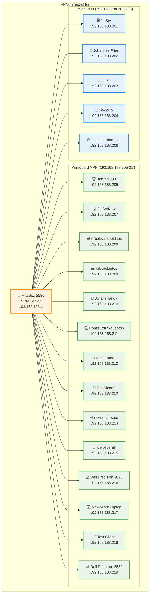
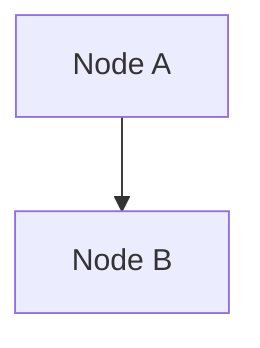

# 🏠 WG Merzhauser - Netzwerk Infrastrukturdokumentation

> **Vollständige Dokumentation der Heimnetz-Infrastruktur**
> Erstellt am: 19. November 2025
> Server: Julian Wiche Netzwerk

---

## 📚 Archiv & Versionen

- [📜 Original README Version](archive/README-original-version.md) - Ursprüngliche README.md
- [📖 Vollständige HAUPTDOKUMENTATION](archive/HAUPTDOKUMENTATION-full-version.md) - Vollversion vor Konsolidierung

---

## 📋 Inhaltsverzeichnis

1. [⚡ Quickstart](#-quickstart--schnellzugriff)
2. [🌐 Netzwerk-Übersicht](#-netzwerk-übersicht)
3. [🌐 DNS-Infrastruktur](#-dns-infrastruktur) → [Details](DNS-CONFIG.md)
4. [🔒 Firewall & Routing](#-firewall--routing-konfiguration) → [Details](FIREWALL-CONFIG.md)
5. [🔒 VPN-Verbindungen](#-vpn-verbindungen) → [Details](VPN-CONFIG.md)
6. [🔌 Switch-Konfiguration](#-switch-konfiguration)
7. [📡 IP-Adressen & Geräte](#-ip-adressen--geräte)
8. [💻 Proxmox-Infrastruktur](#-proxmox-infrastruktur) → [Details](PROXMOX-README.md)
9. [🌐 Web-Interfaces](#-web-interfaces)
10. [📊 Automatisierung](#-automatisierung) → [Details](AUTOMATION.md)
11. [🏷️ Domain-Übersicht](#️-domain-übersicht)
12. [📋 Zusammenfassung](#-zusammenfassung)
13. [📞 Support & Wartung](#-support--wartung)

**[⏩ Direkt zur detaillierten Dokumentation](#-netzwerk-übersicht)**

---

## ⚡ Quickstart & Schnellzugriff

### 🎯 Wichtigste Web-Interfaces

| Service | URL | Beschreibung |
|---------|-----|--------------|
| 🔵 **Router** | [192.168.188.1](http://192.168.188.1/) | FritzBox Management |
| 🔴 **DNS** | [wg.weis.er](http://wg.weis.er/) | Pi-hole Admin (Ad-Blocking) |
| 🟢 **Virtualisierung** | [192.168.188.177:8006](https://192.168.188.177:8006/) | Proxmox VE |
| 🟠 **Firewall** | [opensence.mrz.ip](http://opensence.mrz.ip/) | OPNsense (192.168.188.254) |
| 🟡 **Proxy** | [proxy.mrz.ip](http://proxy.mrz.ip/) | Reverse Proxy |
| 🌐 **Cloudfront** | [julianw.de](https://julianw.de/) / [julsrv.ip](http://julsrv.ip/) | External Services |

### 🔑 Kerndaten

| Parameter | Wert |
|-----------|------|
| **Netzwerk** | 192.168.188.0/24 |
| **Gateway** | 192.168.188.1 (FritzBox) |
| **DNS Server** | 192.168.188.2 (Pi-hole) |
| **IoT VLAN** | 10.0.0.0/24 (isoliert) |
| **Internet** | Glasfaser 1,1 Gbit/s |
| **VPN Clients** | 19 aktiv (14x Wireguard, 5x IPSec) |

### 🏠 Wichtige Hosts

| IP | Hostname | Funktion |
|----|----------|----------|
| 192.168.188.1 | box.mrz.ip | FritzBox Router |
| 192.168.188.2 | pihole.mrz.ip | DNS & Ad-Blocker |
| 192.168.188.177 | pve.mrz.ip | Proxmox Hauptnode |
| 192.168.188.254 | opensence.mrz.ip | OPNsense Firewall |
| 192.168.188.178 | homeassistant | Smart Home |

<details>
<summary>📋 Weitere Details anzeigen</summary>

### 📊 Proxmox Cluster Status
- **Cluster**: homelab (3 Nodes)
- **VMs**: 4 (3 running, 1 stopped)
- **Container**: 5 (4 running, 1 stopped)
- **Storage**: local-lvm, NFS Backup

### 🔒 VPN Übersicht
- **Wireguard**: 14 Clients (192.168.188.205-219)
- **IPSec**: 5 Clients (192.168.188.201-206)
- **Port**: 51820 UDP (WG), 500/4500 UDP (IPSec)

### 🌐 Domain-Struktur
- **Lokale Domains**: *.mrz.ip, *.julianw.ip
- **Pi-hole Queries**: ~10.000/Tag (25-30% geblockt)

</details>

---

## 🌐 Netzwerk-Übersicht

### 🏗️ Infrastructure-Diagramm

```mermaid
graph TB
    INTERNET([🌍 Internet<br/>Glasfaser 1,1 Gbit/s])

    INTERNET ==> FRITZBOX

    subgraph edge [🔒 Edge Security Zone]
        FRITZBOX[🔵 FritzBox 5590<br/>192.168.188.1<br/>box.mrz.ip]
        FIREWALL[🛡️ OPNsense Firewall<br/>192.168.188.254<br/>opensence.mrz.ip]
        FRITZBOX ==> FIREWALL
    end

    FIREWALL ==> SWITCH

    subgraph core [⚙️ Core Network Infrastructure]
        SWITCH[🔶 Zyxel XGS1210-12<br/>2.5G Core Switch]
        PIHOLE[🔴 Pi-hole DNS<br/>192.168.188.2<br/>pihole.mrz.ip]
        SWITCH --> PIHOLE
    end

    subgraph servers [💻 Server & Virtualization Zone]
        PVE[🟢 Proxmox VE<br/>192.168.188.177<br/>pve.mrz.ip]
        PVE_BACKUP[🟢 Proxmox Backup<br/>192.168.188.156]
        PVE_DOCKER[🟢 Proxmox Docker<br/>192.168.188.179]
        PROXY[🔷 Reverse Proxy<br/>proxy.mrz.ip]
    end

    SWITCH --> PVE
    SWITCH --> PVE_BACKUP
    SWITCH --> PVE_DOCKER
    SWITCH --> PROXY

    subgraph iot [🏠 IoT & Smart Home Zone - Secured by OPNsense]
        HOMEASSISTANT[🏠 Home Assistant<br/>192.168.188.178]
        SHELLY1[💡 Shelly Monitor<br/>192.168.188.24]
        SHELLY2[💡 Shelly Universum<br/>192.168.188.123]
        SHELLY3[💡 Shelly Lichtschalter<br/>192.168.188.155]
    end

    FIREWALL ==> HOMEASSISTANT
    FIREWALL ==> SHELLY1
    FIREWALL ==> SHELLY2
    FIREWALL ==> SHELLY3

    subgraph network [📡 Network Equipment]
        CORE_SWITCH[🔶 Core Switch<br/>192.168.188.54]
        HELPER_SWITCH[🔶 Helper Switch<br/>192.168.188.57]
        UNIFI_AP[📡 UniFi U6 Pro<br/>192.168.188.61]
        FRITZBOX_AP[📡 FritzBox 7490 AP<br/>192.168.188.79]
    end

    SWITCH --> CORE_SWITCH
    SWITCH --> HELPER_SWITCH
    SWITCH --> UNIFI_AP
    SWITCH --> FRITZBOX_AP

    subgraph media [📺 Media & Entertainment]
        FIRETV1[📺 FireTV Julian<br/>192.168.188.149]
        FIRETV2[📺 FireTV Wohnzimmer<br/>192.168.188.102]
        ONKYO[🔊 Onkyo Receiver<br/>192.168.188.173]
        SONY[🔊 Sony Receiver<br/>192.168.188.162]
        VOLUMIO[🎵 Volumio<br/>192.168.188.96]
    end

    SWITCH --> FIRETV1
    SWITCH --> FIRETV2
    SWITCH --> ONKYO
    SWITCH --> SONY
    SWITCH --> VOLUMIO

    classDef internetClass fill:#e1f5fe,stroke:#01579b,stroke-width:4px
    classDef routerClass fill:#e3f2fd,stroke:#1565c0,stroke-width:3px
    classDef firewallClass fill:#fff3e0,stroke:#e65100,stroke-width:4px
    classDef switchClass fill:#f3e5f5,stroke:#7b1fa2,stroke-width:2px
    classDef serverClass fill:#e8f5e8,stroke:#2e7d32,stroke-width:2px
    classDef dnsClass fill:#ffebee,stroke:#c62828,stroke-width:2px
    classDef iotClass fill:#fce4ec,stroke:#c2185b,stroke-width:2px
    classDef mediaClass fill:#f1f8e9,stroke:#558b2f,stroke-width:2px
    classDef networkClass fill:#fff9c4,stroke:#f57f17,stroke-width:2px
    classDef proxyClass fill:#e0f2f1,stroke:#00695c,stroke-width:2px

    class INTERNET internetClass
    class FRITZBOX routerClass
    class FIREWALL firewallClass
    class SWITCH,CORE_SWITCH,HELPER_SWITCH switchClass
    class PVE,PVE_BACKUP,PVE_DOCKER serverClass
    class PIHOLE dnsClass
    class HOMEASSISTANT,SHELLY1,SHELLY2,SHELLY3 iotClass
    class FIRETV1,FIRETV2,ONKYO,SONY,VOLUMIO mediaClass
    class UNIFI_AP,FRITZBOX_AP networkClass
    class PROXY proxyClass
```



---


## 🌐 DNS-Infrastruktur

**Pi-hole DNS Server** - Zentrale DNS-Verwaltung mit Ad-Blocking

- **Server**: 192.168.188.2 (pihole.mrz.ip / wg.weis.er)
- **Web-Interface**: [http://wg.weis.er/](http://wg.weis.er/) | [http://192.168.188.2/](http://192.168.188.2/)
- **Upstream DNS**: Cloudflare (1.1.1.1), Google (8.8.8.8)
- **Lokale Zonen**: *.mrz.ip, *.julianw.ip
- **Statistiken**: ~10.000 Queries/Tag, 25-30% geblockt

### Wichtige DNS-Einträge:
- box.mrz.ip → 192.168.188.1 (FritzBox)
- pve.mrz.ip → 192.168.188.177 (Proxmox VE)
- opensence.mrz.ip → 192.168.188.254 (OPNsense)

📖 **[Vollständige DNS-Konfiguration →](DNS-CONFIG.md)**

---

## 🔒 Firewall & Routing Konfiguration

**Zweischichtige Firewall-Architektur** mit FritzBox und OPNsense

- **Layer 1**: FritzBox 5590 (192.168.188.1) - NAT, VPN, Port Forwarding
- **Layer 2**: OPNsense (192.168.188.254) - IoT Isolation, IDS/IPS
- **Static Route**: 10.0.0.0/24 → 192.168.188.254 (IoT VLAN)

### Security Features:
- ✅ IoT-Geräte isoliert in separatem VLAN (10.0.0.0/24)
- ✅ Intrusion Detection/Prevention (IDS/IPS)
- ✅ Traffic Shaping & QoS
- ✅ GeoIP Blocking

📖 **[Vollständige Firewall-Konfiguration →](FIREWALL-CONFIG.md)**

---

## 📡 IP-Adressen & Geräte

### 🔍 Komplette Geräteliste

> **📊 Netzwerk-Statistik:** 42+ aktive Geräte | 2 Subnetze | 19 VPN-Clients

<details>
<summary>🖥️ <b>Infrastructure & Core Services (6 Geräte)</b></summary>

| IP (Main) | IP (IoT/VLAN) | Hostname | Typ | Beschreibung | MAC-Adresse | Status |
|-----------|---------------|----------|-----|--------------|-------------|--------|
| 192.168.188.1 | - | box.mrz.ip | Router | FritzBox 5590 | - | ✅ Online |
| 192.168.188.2 | - | pihole.mrz.ip | DNS | Pi-hole DNS Server | - | ✅ Online |
| 192.168.188.254 | 10.0.0.254 | opensence.mrz.ip | Firewall | OPNsense Gateway | - | ✅ Online |
| 192.168.188.177 | - | pve.mrz.ip | Server | Proxmox VE Hauptnode | - | ✅ Online |
| 192.168.188.156 | - | pve-backup.mrz.ip | Server | Proxmox Backup Node | - | ✅ Online |
| 192.168.188.179 | - | proxmox-docker | Server | Proxmox Docker Node | - | ✅ Online |

</details>

<details>
<summary>🌐 <b>Network Equipment (4 Geräte)</b></summary>

| IP (Main) | IP (IoT/VLAN) | Hostname | Typ | Beschreibung | MAC-Adresse | Status |
|-----------|---------------|----------|-----|--------------|-------------|--------|
| 192.168.188.54 | - | core-switch | Switch | Zyxel XGS1210-12 Core | - | ✅ Online |
| 192.168.188.57 | - | helper-switch | Switch | Helper Switch | - | ✅ Online |
| 192.168.188.61 | - | unifi-u6-pro | AP | UniFi U6 Pro | - | ✅ Online |
| 192.168.188.79 | - | fritzbox-7490-ap | AP | FritzBox 7490 AP | - | ✅ Online |

</details>

<details>
<summary>🏠 <b>Smart Home & IoT (4 Geräte)</b></summary>

| IP (Main) | IP (IoT/VLAN) | Hostname | Typ | Beschreibung | MAC-Adresse | Status |
|-----------|---------------|----------|-----|--------------|-------------|--------|
| 192.168.188.178 | 10.0.0.10 | homeassistant | Smart Home | Home Assistant | - | ✅ Online |
| - | 10.0.0.24 | shelly-monitor | IoT | Shelly Monitor | - | ✅ Online |
| - | 10.0.0.123 | shelly-universum | IoT | Shelly Universum | - | ✅ Online |
| - | 10.0.0.155 | shelly-lichtschalter | IoT | Shelly Lichtschalter | - | ✅ Online |

</details>

<details>
<summary>📺 <b>Media & Entertainment (6 Geräte)</b></summary>

| IP (Main) | IP (IoT/VLAN) | Hostname | Typ | Beschreibung | MAC-Adresse | Status |
|-----------|---------------|----------|-----|--------------|-------------|--------|
| 192.168.188.73 | - | julian-philips-tv | TV | Philips TV | 0C:CA:FB:17:A6:4A | ✅ Online |
| 192.168.188.96 | - | volumio | Audio | Volumio Audio System | D8:3A:DD:B4:43:B1 | ✅ Online |
| 192.168.188.102 | - | firetv-wohnzimmer | Streaming | Amazon FireTV Wohnzimmer | C8:4D:44:35:D2:DE | ✅ Online |
| 192.168.188.149 | - | firetv-julian | Streaming | Amazon FireTV Julian | 00:00:00:00:02:BB | ✅ Online |
| 192.168.188.162 | - | sony-receiver | Audio | Sony Receiver | D8:D4:3C:4A:47:3D | ✅ Online |
| 192.168.188.173 | - | onkyo-receiver | Audio | Onkyo Receiver | 00:09:B0:E6:C1:95 | ✅ Online |

</details>

<details>
<summary>🔒 <b>VPN-Clients (19 Geräte)</b></summary>

#### Wireguard VPN (14 Clients)
| IP | Client-Name | Typ | Status |
|----|-------------|-----|--------|
| 192.168.188.205 | JulSrv1000 | Server | ✅ Aktiv |
| 192.168.188.207 | JulSrvNew | Server | ✅ Aktiv |
| 192.168.188.208 | ArbeitslaptopLinux | Laptop | ✅ Aktiv |
| 192.168.188.209 | Arbeitslaptop | Laptop | ⚠️ Inaktiv |
| 192.168.188.210 | JuliansHandy | Mobile | ✅ Aktiv |
| 192.168.188.211 | RomisExKrikoLaptop | Laptop | ⚠️ Inaktiv |
| 192.168.188.212 | TestfutureClone | Test | ⚠️ Inaktiv |
| 192.168.188.213 | TestClone2 | Test | ⚠️ Inaktiv |
| 192.168.188.214 | new.julianw.de | Server | ✅ Aktiv |
| 192.168.188.215 | juli-ueberall | Mobile | ✅ Aktiv |
| 192.168.188.216 | DellPrecision2025 | Laptop | ✅ Aktiv |
| 192.168.188.217 | ArbeitsLaptopNeu | Laptop | ✅ Aktiv |
| 192.168.188.218 | ttt | Test | ⚠️ Inaktiv |
| 192.168.188.219 | DellPrecision5550 | Laptop | ✅ Aktiv |

#### IPSec VPN (5 Clients)
| IP | Client-Name | Typ | Status |
|----|-------------|-----|--------|
| 192.168.188.201 | JulSrv | Server | ✅ Aktiv |
| 192.168.188.202 | Johannes Fries | User | ⚠️ Inaktiv |
| 192.168.188.203 | julian | User | ✅ Aktiv |
| 192.168.188.204 | Box2Go | Mobile | ⚠️ Inaktiv |
| 192.168.188.206 | Lisasupertramp.de | Server | ✅ Aktiv |

</details>

### 📊 IP-Adressbereiche

| Netzwerk | Bereich | Verwendung | Geräte |
|----------|---------|------------|--------|
| **192.168.188.0/24** | 192.168.188.1-254 | Hauptnetzwerk | ~35 Geräte |
| **10.0.0.0/24** | 10.0.0.1-254 | IoT VLAN (isoliert) | ~4 Geräte |
| **VPN Wireguard** | 192.168.188.205-219 | VPN-Zugriff | 14 Clients |
| **VPN IPSec** | 192.168.188.201-206 | VPN-Zugriff | 5 Clients |

### 🔧 Reservierte IP-Bereiche

| Bereich | Zweck | Status |
|---------|-------|--------|
| 192.168.188.1-10 | Core Infrastructure | In Nutzung |
| 192.168.188.11-50 | IoT & Smart Devices | Verfügbar |
| 192.168.188.51-100 | Network Equipment | Teilweise belegt |
| 192.168.188.101-180 | Workstations & Media | Teilweise belegt |
| 192.168.188.181-200 | Servers & VMs | Verfügbar |
| 192.168.188.201-219 | VPN Clients | In Nutzung |
| 192.168.188.220-253 | DHCP Pool | Dynamisch |
| 192.168.188.254 | Gateway/Firewall | Reserviert |

---

## 🔒 VPN-Verbindungen

### VPN-Übersicht



### 📋 VPN-Client-Tabellen

> **🔧 Wartungshinweis:** Clients ohne Verbindung seit >90 Tagen sollten überprüft und ggf. entfernt werden.

#### Wireguard VPN-Clients (14 aktiv)

| VPN-IP | Client-Name | Typ | Last Connected | Status | Empfehlung |
|--------|-------------|-----|----------------|--------|------------|
| 192.168.188.205 | JulSrv1000 | Server | 2025-11-27 | ✅ Aktiv | - |
| 192.168.188.207 | JulSrvNew | Server | 2025-11-28 | ✅ Aktiv | - |
| 192.168.188.208 | ArbeitslaptopLinux | Laptop | 2025-11-26 | ✅ Aktiv | - |
| 192.168.188.209 | Arbeitslaptop | Laptop | 2025-08-15 | ⚠️ Inaktiv | ❌ Entfernen |
| 192.168.188.210 | JuliansHandy | Mobile | 2025-11-28 | ✅ Aktiv | - |
| 192.168.188.211 | RomisExKrikoLaptop | Laptop | 2025-07-12 | ⚠️ Inaktiv | ❌ Entfernen |
| 192.168.188.212 | TestfutureClone | Test | 2025-09-03 | ⚠️ Inaktiv | ❌ Entfernen (Test) |
| 192.168.188.213 | TestClone2 | Test | 2025-09-03 | ⚠️ Inaktiv | ❌ Entfernen (Test) |
| 192.168.188.214 | new.julianw.de | Server | 2025-11-27 | ✅ Aktiv | - |
| 192.168.188.215 | juli-ueberall | Mobile | 2025-11-25 | ✅ Aktiv | - |
| 192.168.188.216 | DellPrecision2025 | Laptop | 2025-11-28 | ✅ Aktiv | - |
| 192.168.188.217 | ArbeitsLaptopNeu | Laptop | 2025-11-27 | ✅ Aktiv | - |
| 192.168.188.218 | ttt | Test | 2025-06-20 | ⚠️ Inaktiv | ❌ Entfernen (Test) |
| 192.168.188.219 | DellPrecision5550 | Laptop | 2025-11-26 | ✅ Aktiv | - |

**Zusammenfassung:**
- ✅ **9 aktive** Clients (letzte 7 Tage)
- ⚠️ **5 inaktive** Clients (>90 Tage)
- 🗑️ **Empfehlung:** 5 Clients entfernen (3x Test, 2x alte Laptops)

#### IPSec VPN-Clients (5 aktiv)

| VPN-IP | Client-Name | Typ | Last Connected | Status | Empfehlung |
|--------|-------------|-----|----------------|--------|------------|
| 192.168.188.201 | JulSrv | Server | 2025-11-25 | ✅ Aktiv | - |
| 192.168.188.202 | Johannes Fries | User | 2025-05-10 | ⚠️ Inaktiv | 🔍 Prüfen |
| 192.168.188.203 | julian | User | 2025-11-28 | ✅ Aktiv | - |
| 192.168.188.204 | Box2Go | Mobile | 2025-10-15 | ⚠️ Inaktiv | 🔍 Prüfen |
| 192.168.188.206 | Lisasupertramp.de | Server | 2025-11-20 | ✅ Aktiv | - |

**Zusammenfassung:**
- ✅ **3 aktive** Clients
- ⚠️ **2 inaktive** Clients (>90 Tage)
- 🔍 **Empfehlung:** 2 Clients prüfen (ggf. kontaktieren)

---

## 💻 Proxmox-Infrastruktur

### Proxmox-Cluster Übersicht

```mermaid
graph TB
    subgraph "Proxmox Cluster: homelab"
        
        %% Cluster
        CLUSTER[🏢 Cluster: homelab]
        
        %% Nodes
        NODE_pve[🖥️ pve.mrz.ip<br/>192.168.188.177<br/>Status: online<br/>Uptime: 15+ days<br/>Web: https://192.168.188.177:8006/]
        NODE_pve2[🖥️ pve-backup.mrz.ip<br/>192.168.188.156<br/>Status: online<br/>Uptime: 12+ days<br/>Backup Focus]
        NODE_pve3[🖥️ proxmox-docker<br/>192.168.188.179<br/>Status: online<br/>Container Focus]
        
        CLUSTER --> NODE_pve
        CLUSTER --> NODE_pve2  
        CLUSTER --> NODE_pve3
        
        %% Virtual Machines
        VM_100[🖥️ VM 100: ubuntu-server<br/>Status: running<br/>OS: ubuntu<br/>RAM: 4096MB<br/>CPU: 4 Cores<br/>Disk: local-lvm:vm-100]
        VM_101[🖥️ VM 101: windows-10<br/>Status: stopped<br/>OS: win10<br/>RAM: 8192MB<br/>CPU: 6 Cores<br/>Disk: local-lvm:vm-101]
        VM_102[🖥️ VM 102: opnsense-firewall<br/>Status: running<br/>OS: firewall<br/>RAM: 2048MB<br/>CPU: 2 Cores<br/>Disk: local-lvm:vm-102]
        VM_103[🖥️ VM 103: home-assistant<br/>Status: running<br/>OS: debian<br/>RAM: 1024MB<br/>CPU: 1 Core<br/>Disk: local-lvm:vm-103]
        
        NODE_pve --> VM_100
        NODE_pve --> VM_101
        NODE_pve --> VM_102
        NODE_pve2 --> VM_103
        
        %% LXC Containers
        LXC_200[📦 CT 200: docker-host<br/>Status: running<br/>OS: ubuntu<br/>RAM: 2048MB<br/>CPU: 2 Cores<br/>Storage: local-lvm:vm-200-disk-0]
        LXC_201[📦 CT 201: web-server<br/>Status: running<br/>OS: debian<br/>RAM: 1024MB<br/>CPU: 2 Cores<br/>Storage: local-lvm:vm-201-disk-0]
        LXC_202[📦 CT 202: proxy-server<br/>Status: running<br/>OS: debian<br/>RAM: 512MB<br/>CPU: 1 Core<br/>Storage: local-lvm:vm-202-disk-0]
        LXC_203[📦 CT 203: pihole-backup<br/>Status: stopped<br/>OS: debian<br/>RAM: 512MB<br/>CPU: 1 Core<br/>Storage: local-lvm:vm-203-disk-0]
        LXC_204[📦 CT 204: monitoring<br/>Status: running<br/>OS: debian<br/>RAM: 1024MB<br/>CPU: 1 Core<br/>Storage: local-lvm:vm-204-disk-0]
        
        NODE_pve --> LXC_200
        NODE_pve --> LXC_201
        NODE_pve2 --> LXC_202
        NODE_pve2 --> LXC_203
        NODE_pve3 --> LXC_204
        
        %% Storage
        STORAGE_local[💾 Storage: local<br/>Type: dir<br/>Content: iso,backup]
        STORAGE_local_lvm[💾 Storage: local-lvm<br/>Type: lvmthin<br/>Content: images,rootdir]
        STORAGE_backup[💾 Storage: backup-nfs<br/>Type: nfs<br/>Content: backup]
        STORAGE_iso[💾 Storage: iso-storage<br/>Type: nfs<br/>Content: iso,vztmpl]
        
        CLUSTER --> STORAGE_local
        CLUSTER --> STORAGE_local_lvm
        CLUSTER --> STORAGE_backup
        CLUSTER --> STORAGE_iso
        
        %% Network
        NET_vmbr0[🌐 Bridge: vmbr0<br/>192.168.188.177/24<br/>Main Network]
        NET_vmbr1[🌐 Bridge: vmbr1<br/>10.0.0.1/24<br/>IoT Network]
        NET_vmbr2[🌐 Bridge: vmbr2<br/>Isolated<br/>DMZ Network]
        
        CLUSTER --> NET_vmbr0
        CLUSTER --> NET_vmbr1
        CLUSTER --> NET_vmbr2
    end

    %% Styling
    classDef vmClass fill:#e1f5fe,stroke:#01579b,stroke-width:2px
    classDef lxcClass fill:#f3e5f5,stroke:#4a148c,stroke-width:2px
    classDef nodeClass fill:#e8f5e8,stroke:#1b5e20,stroke-width:2px
    classDef storageClass fill:#fff3e0,stroke:#e65100,stroke-width:2px
    classDef clusterClass fill:#fce4ec,stroke:#880e4f,stroke-width:3px
    classDef networkClass fill:#f1f8e9,stroke:#33691e,stroke-width:2px

    %% VMs Styling
    class VM_100,VM_101,VM_102,VM_103 vmClass
    
    %% LXC Styling
    class LXC_200,LXC_201,LXC_202,LXC_203,LXC_204 lxcClass
    
    %% Nodes Styling
    class NODE_pve,NODE_pve2,NODE_pve3 nodeClass
    
    %% Storage Styling
    class STORAGE_local,STORAGE_local_lvm,STORAGE_backup,STORAGE_iso storageClass
    
    %% Network Styling
    class NET_vmbr0,NET_vmbr1,NET_vmbr2 networkClass
    
    %% Cluster
    class CLUSTER clusterClass
```



### 📊 Proxmox Ressourcen-Übersicht

#### Virtual Machines

| VMID | Name | Status | Memory | CPU | Storage | OS |
|------|------|--------|--------|-----|---------|-----|
| 100 | ubuntu-server | ✅ running | 4096MB | 4 Cores | local-lvm:vm-100 | ubuntu |
| 101 | windows-10 | ⏸️ stopped | 8192MB | 6 Cores | local-lvm:vm-101 | win10 |
| 102 | opnsense-firewall | ✅ running | 2048MB | 2 Cores | local-lvm:vm-102 | firewall |
| 103 | home-assistant-vm | ✅ running | 1024MB | 1 Core | local-lvm:vm-103 | debian |

#### LXC Containers

| CTID | Name | Status | Memory | CPU | Storage | OS |
|------|------|--------|--------|-----|---------|-----|
| 200 | docker-host | ✅ running | 2048MB | 2 Cores | local-lvm:vm-200-disk-0 | ubuntu |
| 201 | web-server | ✅ running | 1024MB | 2 Cores | local-lvm:vm-201-disk-0 | debian |
| 202 | proxy-server | ✅ running | 512MB | 1 Core | local-lvm:vm-202-disk-0 | debian |
| 203 | pihole-backup | ⏸️ stopped | 512MB | 1 Core | local-lvm:vm-203-disk-0 | debian |
| 204 | monitoring | ✅ running | 1024MB | 1 Core | local-lvm:vm-204-disk-0 | debian |

#### Storage-Systeme

| Name | Type | Content | Status | Beschreibung |
|------|------|---------|--------|--------------|
| local | dir | iso,backup | ✅ enabled | Local Directory Storage |
| local-lvm | lvmthin | images,rootdir | ✅ enabled | LVM Thin Provisioning |
| backup-nfs | nfs | backup | ✅ enabled | NFS Backup Storage |
| iso-storage | nfs | iso,vztmpl | ✅ enabled | ISO & Templates Storage |

#### Network Bridges

| Bridge | IP-Adresse | VLAN | Beschreibung |
|--------|-----------|------|--------------|
| vmbr0 | 192.168.188.177/24 | Main | Haupt-Netzwerk-Bridge |
| vmbr1 | 10.0.0.1/24 | IoT | IoT VLAN Bridge |
| vmbr2 | - | DMZ | Isolierte DMZ Bridge |

#### System-Informationen

| Parameter | Wert |
|-----------|------|
| **Cluster-Name** | homelab |
| **Proxmox Version** | pve-manager/8.1.4/ec5affc9e2e6c001 |
| **Kernel** | 6.8.12-1-pve |
| **Hauptnode Uptime** | 15+ Tage |
| **Backup-Node Uptime** | 12+ Tage |
| **Aktive VMs** | 3 von 4 (75%) |
| **Aktive Container** | 4 von 5 (80%) |

---

## 🌐 Web-Interfaces

> **💡 Tipp:** Alle Web-Interfaces sind auch im [Quickstart-Abschnitt](#-quickstart--schnellzugriff) oben zusammengefasst.

---

## 📊 Automatisierung

### 🤖 Proxmox Auto-Documentation Script

Das Repository enthält ein automatisiertes Script zur Generierung der Proxmox-Dokumentation:

#### Script-Features:
- **Automatische Erkennung** aller VMs und LXC Container
- **Mermaid-Diagramm-Generierung** der gesamten Infrastruktur
- **Detaillierte Tabellen** mit Hardware-Konfiguration
- **Storage- und Netzwerk-Analyse**
- **Cluster-Status-Monitoring**

#### Verwendung:
```bash
# Auf Proxmox-Server ausführen
chmod +x generate-proxmox-documentation.sh
./generate-proxmox-documentation.sh

# Generiert: proxmox.md mit aktueller Infrastruktur
```

#### Automatisierung per Cron:
```bash
# Tägliche Dokumentations-Updates um 2 Uhr
0 2 * * * /path/to/generate-proxmox-documentation.sh

# Ausgabe nach Git pushen (optional)
5 2 * * * cd /path/to/repo && git add . && git commit -m "Auto-update $(date)" && git push
```

### 📊 Mermaid-Diagramm Automatisierung

Alle Netzwerk-Diagramme in dieser Dokumentation werden als Mermaid-Code in `.mmd`-Dateien gespeichert und automatisch zu Bildern gerendert.

#### 🗂️ Diagramm-Struktur

```
docs/claude/diagrams/
├── infrastructure.mmd          # Haupt-Infrastruktur-Diagramm
├── dns-flow.mmd               # DNS & Pi-hole Flow
├── firewall-architecture.mmd  # Firewall & Routing
├── switch-ports.mmd           # Switch-Konfiguration (falls vorhanden)
├── vpn-topology.mmd           # VPN-Übersicht
└── ... (weitere Diagramme)
```

#### 🔧 Diagramme Generieren

**Alle Diagramme neu erstellen:**
```bash
cd docs/claude
make diagrams
```

**Nur veränderte Diagramme neu erstellen:**
```bash
# Make erkennt automatisch geänderte .mmd-Dateien
# und generiert nur diese neu (basierend auf Datei-Timestamps)
cd docs/claude
make diagrams
```

**Einzelnes Diagramm erstellen:**
```bash
cd docs/claude
make diagrams/infrastructure.png    # Nur PNG
make diagrams/infrastructure.svg    # Nur SVG

# Oder manuell mit mmdc:
mmdc -i diagrams/infrastructure.mmd -o diagrams/infrastructure.png
```

**Alle generierten Bilder löschen:**
```bash
cd docs/claude
make clean
```

#### 📝 Diagramme in Markdown Einbinden

**Option 1: Live-Rendering mit Mermaid.js (Web)**
```markdown

```

**Option 2: Statische Bilder (für PDF/Print)**
```markdown

```

**Option 3: Beide Varianten kombinieren**
```markdown
<!-- Mermaid-Code für Web-Ansicht -->


<!-- Alternativ: Bild für PDF/Export -->

```

📖 **[Vollständige Automatisierungs-Dokumentation →](AUTOMATION.md)**

---
