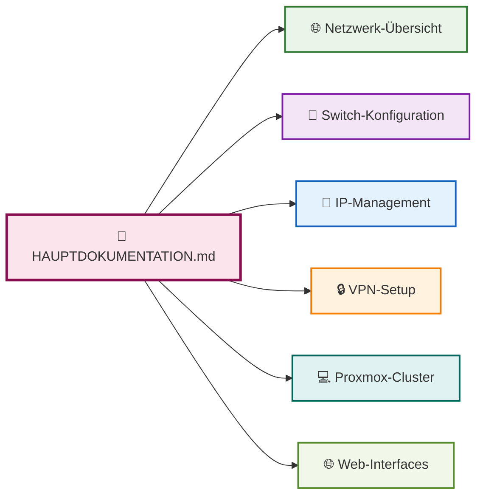

# 🏠 WG Merzhauser - Netzwerk Infrastrukturdokumentation

🧠 **Vollständige Netzwerkdokumentation powered by Mermaid + Markdown**

> **📋 HAUPTDOKUMENTATION: [HAUPTDOKUMENTATION.md](./HAUPTDOKUMENTATION.md)**  
> *Hier finden Sie die komplette, zentrale Dokumentation mit allen Diagrammen und Tabellen*

## 🚀 Quick Start

### 📖 **Sofort loslegen**:
1. **[📋 HAUPTDOKUMENTATION.md](./HAUPTDOKUMENTATION.md)** öffnen für vollständige Übersicht
2. **Mermaid-Diagramme** werden automatisch in GitHub/VS Code gerendert
3. **Web-Interfaces** über Bookmark-Liste direkt zugänglich

### 🌐 **Wichtige URLs**:
- 🔵 **Router**: http://192.168.188.1/
- 🔴 **DNS**: http://wg.weis.er/  
- 🟢 **Proxmox**: https://192.168.188.177:8006/
- 🟠 **Firewall**: http://openSence.mrz.ip/

## 📂 Repository-Struktur

| Datei | Beschreibung |
|-------|--------------|
| **[HAUPTDOKUMENTATION.md](./HAUPTDOKUMENTATION.md)** | 🔥 **ZENTRALE DOKUMENTATION** - Alles in einer Datei |
| [switch-mrz.md](./switch-mrz.md) | Switch-Port-Konfiguration |
| [ip-domain-liste.md](./ip-domain-liste.md) | Kompakte IP-/Domain-Liste |
| [fritzbox-geraete-vollstaendig.md](./fritzbox-geraete-vollstaendig.md) | FritzBox-Geräte-Inventar |
| [generate-proxmox-documentation.sh](./generate-proxmox-documentation.sh) | Proxmox Auto-Dokumentation |
| [PROXMOX-README.md](./PROXMOX-README.md) | Proxmox-Script-Anleitung |

## 🎯 Was dokumentiert ist

### 🌐 **Netzwerk-Infrastructure**:
- **FritzBox 5590 Fiber** (1,1 Gbit/s Glasfaser)
- **Zyxel XGS1210-12** Switch mit detaillierter Port-Zuordnung
- **~90 IP-Adressen** und **25+ VPN-Verbindungen**
- **Pi-hole DNS** + **OPNsense Firewall**

### 💻 **Server & Virtualisierung**:
- **3 Proxmox-Nodes** mit VMs und LXC-Containern
- **Automatische Dokumentations-Scripts**
- **Home Assistant**, **Docker**, **Backup-Systeme**

### 📱 **Smart Home & IoT**:
- **Shelly-Devices**, **Smart TV**, **Audio-Systeme**
- **Separate IoT-VLAN** (10.0.0.0/24)
- **15+ Smart Home Geräte**

## 🔧 Automatisierung

### **Proxmox-Dokumentation automatisch generieren**:
```bash
# Script auf Proxmox-Server ausführen
wget https://raw.githubusercontent.com/dajuly20/network-documentation-plan-wg-merzhauser/main/generate-proxmox-documentation.sh
chmod +x generate-proxmox-documentation.sh
./generate-proxmox-documentation.sh
```

### **Regelmäßige Updates**:
```bash
# Cron-Job für tägliche Aktualisierung
0 2 * * * /path/to/generate-proxmox-documentation.sh
```

## 📊 Mermaid-Diagramme

Die Dokumentation enthält interaktive Mermaid-Diagramme für:
- 🌐 **Netzwerk-Topologie**
- 🔌 **Switch-Port-Zuordnung**  
- 🔒 **VPN-Infrastruktur**
- 💻 **Proxmox-Cluster**
- 📊 **Device-Statistiken**

*Diagramme werden automatisch in GitHub, VS Code (mit Mermaid-Extension) und anderen Markdown-Viewern gerendert.*

## 🎨 Visualisierung



## 🏷️ Tags & Keywords

`network-documentation` `proxmox` `mermaid-diagrams` `fritzbox` `pihole` `opnsense` `smart-home` `infrastructure` `automation` `vpn` `homelab`

---

**📍 Für die vollständige Dokumentation siehe: [HAUPTDOKUMENTATION.md](./HAUPTDOKUMENTATION.md)**
