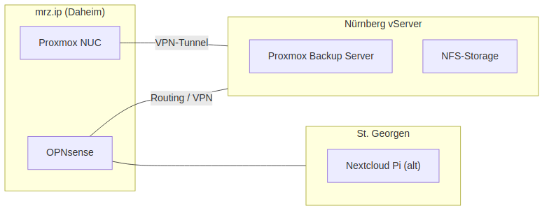

# 🔒 VPN-Konfiguration

> **Detaillierte VPN-Setup Dokumentation**
> [← Zurück zur Hauptdokumentation](README.md)

## VPN-Übersicht

## Wireguard VPN-Clients (192.168.188.205-219)

| VPN-IP | Client-Name | Typ | Beschreibung |
|--------|-------------|-----|--------------|
| 192.168.188.205 | JulSrv1000 | Server | Server 1000 |
| 192.168.188.207 | JulSrvNew | Server | Neuer Server |
| 192.168.188.208 | ArbeitslaptopLinux | Laptop | Work Laptop Linux |
| 192.168.188.209 | Arbeitslaptop | Laptop | Work Laptop |
| 192.168.188.210 | JuliansHandy | Mobile | Julian's Phone |
| 192.168.188.211 | RomisExKrikoLaptop | Laptop | Romi's Laptop |
| 192.168.188.212 | JulianW.de-TestfutureClone | Test | Test Clone |
| 192.168.188.213 | JulianwDeTestClone2 | Test | Test Clone 2 |
| 192.168.188.214 | new.julianw.de | Server | New Server |
| 192.168.188.215 | juli-ueberall | Mobile | Julian Mobile |
| 192.168.188.216 | neuerDellPrecsicion2025 | Laptop | Dell Precision 2025 |
| 192.168.188.217 | ArbeitsLaptopNeu | Laptop | New Work Laptop |
| 192.168.188.218 | ttt | Test | Test Client |
| 192.168.188.219 | NeuerDellPrecsicion5550 | Laptop | Dell Precision 5550 |

## IPSec VPN-Clients (192.168.188.201-206)

| VPN-IP | Client-Name | Typ | Beschreibung |
|--------|-------------|-----|--------------|
| 192.168.188.201 | JulSrv | Server | Hauptserver |
| 192.168.188.202 | Johannes Fries | User | Johannes |
| 192.168.188.203 | julian | User | Julian |
| 192.168.188.204 | Box2Go | Mobile | Mobile Box |
| 192.168.188.206 | Lisasupertramp.de | Server | Lisa's Server |

## VPN Server Konfiguration

- **Wireguard VPN**: 14 Clients
- **IPSec VPN**: 5 Clients
- **Server**: FritzBox 5590 (192.168.188.1)
- **Port Wireguard**: 51820 UDP
- **Port IPSec**: 500/4500 UDP
- **MyFRITZ! DynDNS**: Aktiviert

[← Zurück zur Hauptdokumentation](README.md)
