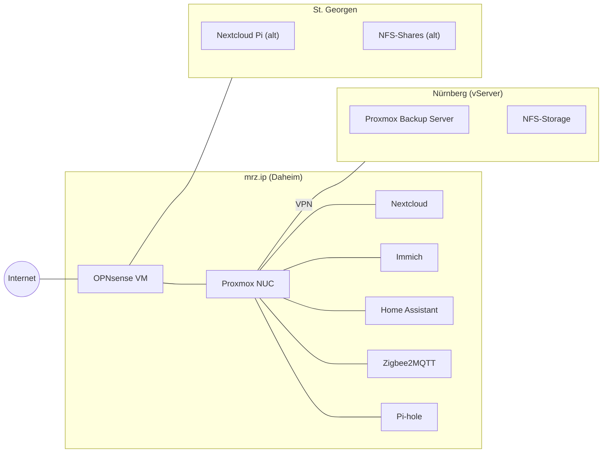
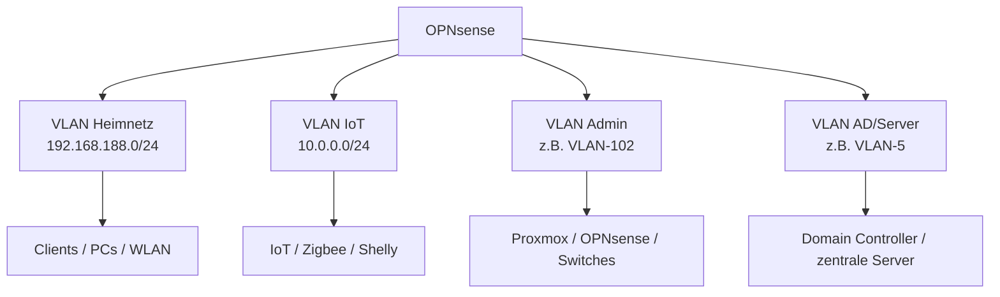
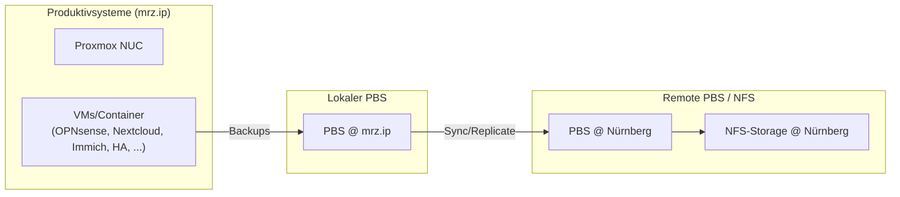

# Netzwerk- & Infrastruktur-Dokumentation – Kontext für KI-Assistenten

Dieses Dokument fasst die aktuelle Umgebung von Julian zusammen, damit ein KI-Assistent (z. B. Claude / ChatGPT) Projekte rund um Homelab, Proxmox, Netzwerk, Automatisierung und Doku besser verstehen und konsistent weiterführen kann.

---

## 1. Gesamtüberblick

- Betreiber: **Julian Wiche**, Standort Freiburg.
- Nutzung: Mischung aus **Homelab**, **Produktivdiensten** für Familie/Freunde und teils auch Kunden- / Testumgebungen.
- Zentrale Themen:
  - Proxmox-Cluster & Virtualisierung
  - OPNsense-Firewall & Routing
  - Nextcloud, Immich, Docker-Services
  - Zentrale DNS/DHCP-Konsolidierung
  - Backups & Offsite-Sicherung (Nürnberg)
  - Home Assistant & Smart Home (Zigbee, Automationen)
  - Git-basierte Dokumentation (z. B. `karola-gerhard-chatgpt`, Netzwerk-Doku)

---

## 2. Standorte & Rollen

### 2.1 Standorte (Sites)

| Site / Name | Typ            | Rolle / Zweck                                   | Beispiele / Hinweise                                   |
|-------------|----------------|-------------------------------------------------|--------------------------------------------------------|
| **mrz.ip** (Daheim) | Hauptstandort  | Zentrale Proxmox-Hosts, OPNsense, HomeLab, Storage   | Intel NUC, Proxmox, OPNsense-VM, Nextcloud, Immich     |
| **Nürnberg** | Remote / vServer | Offsite-Backups, Proxmox Backup Server, NFS-Storage | PBS, NFS-Exports Richtung Home                         |
| **St. Georgen** | Externer Standort | Ehemalige Nextcloud Pi & NFS-Shares (teils abgelöst) | Alte Dienste, schrittweise Ablösung / Migration        |

---

## 3. Netzwerk & VLANs

### 3.1 Aktuelle zentrale Netze

| Netz / VLAN                 | Zweck                         | Router/DHCP                     | Besonderheiten                             |
|-----------------------------|------------------------------|----------------------------------|-------------------------------------------|
| **192.168.188.0/24**       | Hauptnetz (Heimnetz)          | FRITZ!Box                       | Standard-Clients, WLAN, Internetzugang    |
| **10.0.0.0/24** (IoT)      | IoT / „unsichere“ Geräte      | Ubiquiti EdgeRouter (DHCP)      | Feste Leases für DNS-Zuordnung            |

> Ziel: DHCP & DNS zentral in **OPNsense** konsolidieren und EdgeRouter abschalten.

### 3.2 Logische VLAN-Struktur (geplant / teilweise umgesetzt)

| VLAN-Name | Beispiel-Subnetz        | Zweck                      |
|-----------|-------------------------|----------------------------|
| VLAN-4    | (IoT / Smart Home)      | Sensoren, Zigbee-Gateway, IoT |
| VLAN-5    | (AD / Server)          | Domain Controller, zentrale Server |
| VLAN-102  | (Admin / Mgmt)         | Management von Switches, Proxmox, OPNsense |

> Switch-Port-Zuordnungen werden **bewusst flexibel** gehalten und nicht hart in den Diagrammen verankert, da sie sich häufig ändern.

---

## 4. Proxmox & Virtualisierung

### 4.1 Proxmox-Hosts

| Host           | Hardware                       | Rolle / Dienste                                |
|----------------|--------------------------------|------------------------------------------------|
| **Intel NUC** (z. B. NUC6CAYH) | Celeron J3455, 8 GB RAM, NVMe-SSD | Haupt-Proxmox-Node, OPNsense-VM, diverse VMs/Container |
| **pve2-vaio**  | Sony VAIO, älteres System      | Zusätzlicher Node / Testsystem                 |

- Proxmox VE Version: **8.x** (aktuell).
- ZFS-Pools werden teilweise genutzt.
- Ziel: Mehrere kleine physische Systeme (Raspberry Pis, etc.) in Proxmox-VMs/Container konsolidieren.

### 4.2 Dienste, die bereits auf Proxmox wandern oder dort laufen

| Dienst             | Typ        | Aktuelle / geplante Plattform      |
|--------------------|-----------|-------------------------------------|
| OPNsense           | VM        | Läuft als zentrale Firewall/Router auf Proxmox |
| Nextcloud Hub 8    | Container | Übergang von „nativ“ → Docker → Proxmox |
| Immich             | Container | Medienverwaltung / Foto-Upload      |
| Portainer          | Container | Docker-Management mit SSL (Port 9000) |
| Diverse Test-VMs   | VMs       | FreePBX, Linux-Experimente, etc.    |

---

## 5. Netzwerkdienste: DNS, DHCP, VPN

### 5.1 DNS & DHCP

| Komponente        | Rolle                               | Status / Ziel                          |
|-------------------|--------------------------------------|----------------------------------------|
| **Pi-hole**       | Lokale DNS-Filterung / Ads          | Nutzt interne Domains wie `*.julianw.ip` |
| **FRITZ!Box**     | DHCP im 192.168.188.0/24            | Soll mittelfristig entlastet werden     |
| **EdgeRouter**    | DHCP im 10.0.0.0/24 (IoT)           | **Soll abgeschaltet** werden            |
| **OPNsense**      | Zentrale Firewall, DNS, (DHCP geplant) | Ziel: Alle Leases & DNS-Einträge hier konsolidieren |

### 5.2 VPN & Site-Verbindungen

| Verbindung         | Technik       | Zweck                                     |
|--------------------|--------------|-------------------------------------------|
| NUC ↔ Rootserver   | VPN (z. B. WireGuard) | Zugriff auf Nürnberg-NFS, Offsite-Backup |
| Intern             | Routing via OPNsense | Segmentierung der VLANs                  |

---

## 6. Storage, Backups & Offsite

### 6.1 Storage-Komponenten

| Ort         | Typ           | Einsatz                           |
|-------------|---------------|-----------------------------------|
| mrz.ip      | Lokale Disks, ggf. ZFS | VMs, Container, Nextcloud-Daten |
| Nürnberg    | NFS-Storage, PBS | Backup-Ziel, externe Storage-Volumes |
| St. Georgen | NFS-Shares (alt) | Alt-Daten, teils noch gemountet  |

### 6.2 Backups

- Proxmox Backup Server (PBS) **lokal** und in **Nürnberg**.
- Ziel:
  - Regelmäßige Backups aller produktiven VMs (OPNsense, Nextcloud, Immich, Home Assistant, etc.).
  - Versionierung & Offsite-Redundanz.
  - Möglichst automatisierte Prüfläufe / Restore-Tests.

---

## 7. Home Assistant & Smart Home

### 7.1 Aktueller Stand

| Komponente               | Plattform     | Status / Bemerkungen                          |
|--------------------------|--------------|-----------------------------------------------|
| Home Assistant           | VM / Container | Läuft bereits produktiv                      |
| Zigbee2MQTT              | Container     | Anbindung diverser Zigbee-Geräte             |
| Sensoren/Aktoren         | Zigbee, Shelly, etc. | Präsenz, Schalter, Steckdosen, Lichter   |
| Node-RED (alt)           | Raspberry Pi  | Komplexe, historisch gewachsene Flows        |

> Ziel: Node-RED-Logik behutsam migrieren (z. B. in HA-Automationen oder strukturiertere Flows mit Versionskontrolle).

### 7.2 Geplante Integrationen

- **ChatGPT / KI in Home Assistant**:
  - Sprachassistent („Bertha/Janis“), Szenensteuerung, ToDo-Verwaltung.
- Zentrale Darstellung:
  - Dashboards mit:
    - Batterie-Übersichten
    - „Last seen“-Tabellen für Geräte
    - Ausfall-Erkennung (z. B. > 5 min nicht mehr gesehen).

---

## 8. Web-Dienste & IAM

### 8.1 Zentrale Dienste

| Dienst         | Domäne / Host                 | Zweck                           |
|----------------|-------------------------------|----------------------------------|
| Nextcloud      | `nextcloud.*` (intern/extern) | File-Sharing, Groupware          |
| Immich         | `immich.wiche.eu`             | Foto- & Videoverwaltung          |
| Authentik      | Intern/extern                | Zentrales IAM / SSO              |
| Portainer      | SSL auf Port 9000             | Docker-Verwaltung                |
| Unifi Controller | Container/VM                | Netzwerk-Management (APs, etc.)  |

### 8.2 IAM & Authentifizierung

- Authentik als zentrales Identity- & Access-Management:
  - Integration mit Nextcloud, Portainer, weiteren Webdiensten.
- Mittel-/Langfristig:
  - YubiKey / FIDO2 & Fingerprint (pam_u2f, pam_fprintd) für lokale Logins & sudo.
  - Einheitliche Credentials über AD & Authentik hinweg.

---

## 9. Git & Dokumentation

### 9.1 Repositories & Zielstruktur

| Repository                         | Zweck                                     |
|------------------------------------|-------------------------------------------|
| `karola-gerhard-chatgpt`          | Zentrale Doku (Netzwerk, VLANs, Ports, VPN, etc.) |
| `network-documentation-plan-wg-merzhauser` | Detaillierte Netzwerk-Dokumentation für WG / Merzhauserstraße |
| Diverse andere Repos (Compose, Skripte) | Docker-Compose-Files, Bash/PowerShell-Skripte |

- Format-Präferenzen:
  - **Markdown** (README, Architektur-Notizen)
  - **Mermaid** (Diagramme)
  - **YAML** (Config, HA-Dashboards)
  - **Makefile**-Workflows z. B. zum Generieren von Diagrammen aus Markdown/Mermaid.

---

## 10. Architekturdiagramme (Mermaid)

### 10.1 High-Level-Sites & Verbindungen

### 10.2 VLAN- & Netz-Segmentierung (vereinfacht)

### 10.3 Backup- und Restore-Flows

---

## 11. Offene Punkte & ToDos (Übersichtstabelle)

| Bereich              | Aufgabe / Fragestellung                                          | Priorität |
|----------------------|------------------------------------------------------------------|-----------|
| DHCP/DNS Migration   | Leases & DNS aus FRITZ!Box + EdgeRouter extrahieren & in OPNsense importieren | Hoch      |
| EdgeRouter           | Nach erfolgreicher Migration IoT-DHCP auf OPNsense → EdgeRouter abschalten   | Mittel    |
| Raspberry Pi         | Dienste (Apache Reverse Proxy, Node-RED, weitere Smart-Home-Komponenten) nach Proxmox migrieren | Hoch      |
| Nextcloud            | Migration von nativer Installation → Docker → Proxmox-Setup finalisieren    | Mittel    |
| Dokumentation        | Einheitliche Struktur in `karola-gerhard-chatgpt` + Unterordner (z. B. `claude/`) | Mittel    |
| Backups              | Regelmäßige Restore-Tests, Monitoring der PBS-Jobs               | Mittel    |
| Home Assistant       | KI-Integration (ChatGPT/Claude), ToDo-Anzeige, Voice-Assistant   | Mittel    |
| IAM / Authentik      | SSO-Integration weiterer Dienste, YubiKey/FIDO2-Rollout          | Langfristig |

---

## 12. Wie KI hier helfen soll

- **Dokumentation pflegen & erweitern**
  - Markdown-Dateien erstellen/erweitern (`README`, Detail-Dokus, Migrationspläne).
  - Mermaid-Diagramme anpassen, neue Diagramme generieren.
- **Migrations- & Umbaupläne**
  - Schritt-für-Schritt-Anleitungen (Proxmox-VMs, Docker-Compose, OPNsense-Konfiguration, etc.).
- **Skripte & Automatisierung**
  - Bash, PowerShell, Docker-Compose, Ansible-Snippets, Makefiles.
- **Fehlersuche & Optimierung**
  - Logs erklären, Konfigurationen prüfen, Alternativen vorschlagen.

> Wichtig: Antworten sollten stets so formuliert sein, dass sie **direkt als Datei übernommen** oder mit minimalen Änderungen in Repos / Konfigurationen eingefügt werden können (z. B. valid YAML, funktionsfähige Bash-Skripte, lauffähige Docker-Compose-Files).
