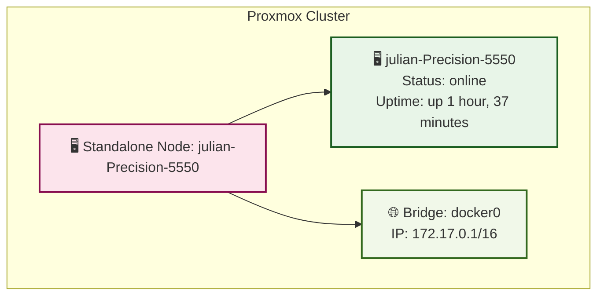

# Proxmox VE Infrastruktur-Dokumentation

Automatisch generiert am: $(date)
Server: $(hostname) ($(hostname -I | awk '{print $1}'))

## 📊 Detaillierte Informationen

### 🖥️ System-Informationen
- **Hostname**: julian-Precision-5550
- **IP-Adresse**: 192.168.188.141
- **Uptime**: up 1 hour, 37 minutes
- **Kernel**: 6.8.0-87-generic
- **Proxmox Version**: 

### 🖥️ Virtual Machines

| VMID | Name | Status | Memory | CPU | Storage | OS |
|------|------|--------|--------|-----|---------|-----|

### 📦 LXC Containers

| CTID | Name | Status | Memory | CPU | Storage | OS |
|------|------|--------|--------|-----|---------|-----|

### 💾 Storage

| Name | Type | Content | Status |
|------|------|---------|--------|

---
*Automatisch generiert durch Proxmox Documentation Script*  
*Datum: $(date)*  
*Server: $(hostname)*
